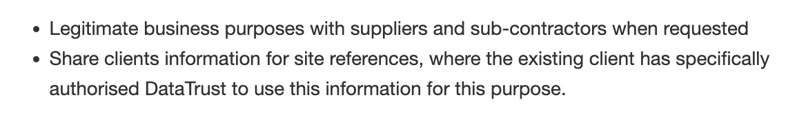

# Knowledge assessment: Research copyright, ethics and privacy

**Student details**

Student:  880616253 / David Cruwys

**Student signature and Date**

David Cruwys, 13 Dec, 2021

1. Short answer questions.
# Scenario documents as outlined in assessment

  - [_Copyright statement_](./Copyright_Statement.pdf)
  - [_Privacy Policy_](./Privacy%20Policy.pdf)
  - [_Strategic Plan_](./Strategic%20Plan.pdf).
 |
## Specific task instructions

In this scenario, you&#39;re an IT Trainee at [_DataTrust_](https://share.tafensw.edu.au/share/file/22c51ecc-efca-455e-a7f2-18847749f30c/1/dataTrust.zip/dataTrust/index.html). DataTrust is currently reviewing its policies and procedures that relate to copyright, privacy and ethics and you&#39;ve been asked to do some initial research so that you can assist the organisation in updating and implementing its policies and procedures.

## Part 1: Short answer questions

### 1 Read DataTrust's [_Copyright statement_](./Copyright_Statement.pdf)

  **A. Is this a useful Copyright statement for visitors to the website?**

  Not really, the following statement is vague

  *Material published on this site (information, text, images, sounds and audio-visual material) is protected by intellectual property law: this includes copyright and, where applicable, moral and cultural rights.*

  The Copyright does not use the correct format. it should follow this Australian guideline:

  > © [name of rightsholder or rightsholders] [publication year]
  > e.g.  © XYZ Press and contributors 2014

  > [date of terms of use]

  Example of how they should have written 
  
  

  Things they could optionally included are:
  
  - links to their terms of use on each website page (eg. in footer)
  - separate webpage for your terms of use (and including for example, [Privacy Policy](./Privacy%20Policy.pdf));
  - Ensure that the terms of use for each piece of content on site, including downloadable files, is clear and vetted by lawyer

  **B. What do you need to do if you want to use any content from the DataTrust website?**

  Contact the DataTrust copyright officer at DataTrust@dmail.com

### 2. According to [_Australian Privacy Principle (APP) 11_](https://www.oaic.gov.au/agencies-and-organisations/app-guidelines/chapter-1-app-1-open-and-transparent-management-of-personal-information)

Open and transparent management of personal information – the organisation&#39;s APP privacy policy must contain the following information:

**A: Does APP 1 apply to DataTrust?**

Mostly Yes, the exception is around overseas information disclosure

> The kinds of personal information that the entity collects and holds

  See: 'What data do we collect?'

> How the entity collects and holds personal information
  
  See: 'How do we store the data we collect?'

> The purposes for which the entity collects, holds, uses and discloses personal information

  See: 'Who do we disclose information to?'
  
> How an individual may access personal information about the individual that is held by the entity and seek the correction of such information

  See: 'How do we protect the information we store?'

> How an individual may complain about a breach of the Australian Privacy Principles, or a registered app code (if any) that binds the entity, and how the entity will deal with such a complaint
  
  See: 'Dealing with complaints'

> Whether the entity is likely to disclose personal information to overseas recipients:
> plus
> The countries in which such recipients are likely to be located if it is practicable to specify those countries in the policy.

  This is not touched on in the privacy policy, but could be inferred as:

  If the overseas representative happens to be a vetted supplier or sub-contractor and the information is for legitimate business purposes.

**B. Compare DataTrust&#39;s Privacy Policy with the Privacy Act**

In particular the [_Australian Privacy Principles_](https://www.oaic.gov.au/individuals/privacy-fact-sheets/general/privacy-fact-sheet-17-australian-privacy-principles) (APP) and the [_Notifiable Data Breaches scheme_](https://www.oaic.gov.au/privacy/notifiable-data-breaches/about-the-notifiable-data-breaches-scheme) (NDB), to check whether they&#39;re covered in the privacy policy.

| **Requirements** | **Privacy policy reference** | **Privacy Act/ NDB** |
| --- | --- | --- |
| The kinds of personal information that the entity collects and holds || APP |
| How the entity collects and holds personal information || APP |
| The purposes for which the entity collects, holds, uses and discloses personal information || APP ||
| How an individual may access personal information about the individual that is held by the entity and seek the correction of such information || APP|
| How an individual may complain about a breach of the Australian Privacy Principles, or a registered app code (if any) that binds the entity, and how the entity will deal with such a complaint || APP / NDB|
| Whether the entity is likely to disclose personal information to overseas recipients | Not specified in policy |APP|
| If the entity is likely to disclose personal information to overseas recipients—the countries in which such recipients are likely to be located if it is practicable to specify those countries in the policy. | Not specified in policy |APP|

**C. APP 11 is about security of personal information.**

Using examples from DataTrust’s privacy policy, explain how the policy covers this principle

- DataTrust electronic data is protected by a Watchguard Firebox firewall. This firewall is designed to prevent intrusion from unauthorised parties accessing information stored on the DataTrust network via the internet.
- DataTrust virus protection is regularly updated to protect against the loss or corruption of data from a virus, and to prevent the installation of any virus that may provide unauthorised parties with a “back door” into our computer systems.
- All authorised personnel require a password and a logon to access the DataTrust network. This applies to both internet access and onsite computer terminal access.
- Logons for the DataTrust network can only be authorised via the DataTrust Systems Administrator. Only DataTrust permanent staff may apply for a logon to this network.

**D. How does privacy legislation and standards, as well as DataTrust’s privacy policy relate to the goals listed in DataTrust’s Strategic Plan?**

Two of DataTrust's four key areas of competency relate to privacy.

*Protect* - Audit and design technology systems, providing the ultimate preventative shield to defend your data.
*Manage* - Govern all business performance, ensuring compliance and providing internal and external training for all business areas.

Also their Vision and Mission are focussed talk about this

*Mission* - Providing solutions to ensure our clients of information security and privacy
*Vision* - Global leader in information security and privacy.

**E. If DataTrust was to expand or increase their customer base into Europe, what other privacy legislation would they need to comply with?**

GDPR - General Data Protection Regulation is a regulation in EU law on data protection and privacy in the European Union (EU) and the European Economic Area (EEA).

### 3. Code of Ethics

Locate the Australian Computer Society (ACS) Code of Ethics, as well as at least one other example of a code of ethics from an ICT organisation.

Discuss one of the values from each code of ethics, as follows:

  A. What is the value that you&#39;re discussing?
    - The primacy of public interest (Contribute to society and to human well-being)
    
  B. What is the purpose of the value?
    - When working in ITC, you value projects that support the great good of people and society. It is about quality of life, human rights, protecting peoples individuals right to autonomy.
    
  C. Give two examples of situations where each value would apply.
    - When collecting information on mass, eg via camera and people recognition software:
      - It would appropriate to anonymise information
      - You would securely store any information
      - What is stored and the time it is stored should meet jurisdiction regulatory rules.
      - Don't sell the information
      - Don't copy the information to your own personal machine.
    - When storing passwords.
      - Don't use clear text
      - Do use strong encryption and/or hashing

  D. List website links for each of the codes of ethics.

- [Australian Computer Society (ACS)](./ACS-Code-of-Ethics.pdf)
- [Association for Computing Machinery](https://www.acm.org/code-of-ethics)

### 4. List and outline the relevant federal and NSW legislation in Australia

For each of the following, and discuss how they relate to working in an ICT environment

  - Access and equity

    Access and equity strategy provides a framework to ensure that ICT workplaces meet the needs of staff and customers.
    From an ITC point of view, if you have diversity for people with a disability, women and multicultural, multi-sexual backgrounds, then you also start to see diversity in ITC projects that have broader impact.

  - Workplace health and safety.

    This legislation is about protecting people in the workplace and it will relate to harassment and abuse, as well as general safety guidelines.
    A specific concern that affects ICT is data privacy, surveillance, hacking, digital stalking/black mail.

### 5. Copyright is one form of intellectual property.

List and outline the relevant federal and state/territory legislation and guidelines in Australia (acts and regulations) relating to other forms of intellectual property, and discuss how they relate to working in an ICT environment

  A. Patents

  IP legislation changes are part of the Patents Act of 1990 and were amended via [IP Laws Amendment Bill 2014](http://www.aph.gov.au/Parliamentary_Business/Bills_Legislation/Bills_Search_Results/Result?bId=r5192)
  In NSW you can apply for a patent via [Service NSW - Apply for Patent](https://www.service.nsw.gov.au/transaction/apply-patent)
  A type of patent that relates to ITC is the [Innovation Patent](https://www.ipaustralia.gov.au/patents/understanding-patents/types-patents)

  B. Trade Marks

  [IP Australia](https://www.ipaustralia.gov.au/trade-marks)
  [US Trademarks](https://www.uspto.gov/trademarks/search)

  A trademark is an easily recognizable symbol, phrase, or word that denotes a specific product. It legally differentiates a product or service from all others of its kind and recognizes the source company's ownership of the brand.
  It legally differentiates a product or service from all others of its kind and recognizes the source company's ownership of the brand.

  Apple has an extensive list of trademarks, here are a few listing Trademark and the Generic Term

  |Trademark | Generic Term |
  | - | - |
  | 3D Touch® | interface |
  | AirDrop® | software feature |
  | AirMac® | wireless hardware/software solution |
  | AirPlay® | software feature |
  | AirPods® | wireless headphones |
  | AirPods Pro® | wireless headphones |
  | AirPort® | wireless hardware/software solution |
  | AirPort Express® | wireless hardware/software solution |

  C. Designs

  Design registration, protects the appearance of an article and can be an important part in an IP strategy for protecting technical innovation. They can provide significant protection in situations where patent protection is unavailable or not justified.
  Designs can be registered in Australia and Registered designs protect the appearance (shape, configuration, pattern, ornamentation) of a product. 

  D. Circuit Layouts

  The Circuit Layouts Act 1989 - Provides for the protection of certain layouts for integrated circuits.
  Circuit layouts rights protect the layout plans or designs of electronic components for integrated circuits, computer chips, or semi-codnductors used in:
    - household items (e.g. digital watches, television sets and washing machines)
    - medical devices (e.g. heart pacemakers)
    - anything else with electronic components.

  E. Trade secrets

  Australia has no common law or statutory cause of action directed specifically to the protection of trade secrets. Instead, Australia complies with its obligations under article 39 of the 1995 Trade-Related Aspects of Intellectual Property Rights Agreement (TRIPS) by giving trade secrets legal protection through the equitable doctrine of "breach of confidence" and, where an appropriate clause exists, breach of contract.
  A trade secret can be any confidential information of value. Unlike other IP rights, trade secrets are protected by keeping them a secret, and are not registered with IP offices.
  From an ICT perspective, Trade secret protection is enforced via contract and confidentiality agreements.

