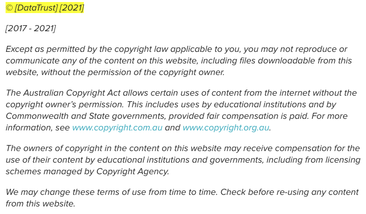
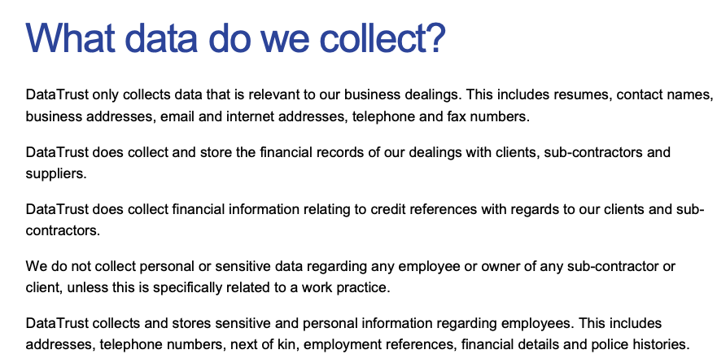

# Knowledge assessment: Research copyright, ethics and privacy

**Student details**

Student:  880616253 / David Cruwys

**Student signature and Date**

David Cruwys, 10th Nov, 2021

1. Short answer questions.
# Scenario documents as outlined in assessment

  - [_Copyright statement_](./Copyright_Statement.pdf)
  - [_Privacy Policy_](./Privacy%20Policy.pdf)
  - [_Strategic Plan_](./Strategic%20Plan.pdf).
 |
## Specific task instructions

In this scenario, you&#39;re an IT Trainee at [_DataTrust_](https://share.tafensw.edu.au/share/file/22c51ecc-efca-455e-a7f2-18847749f30c/1/dataTrust.zip/dataTrust/index.html). DataTrust is currently reviewing its policies and procedures that relate to copyright, privacy and ethics and you&#39;ve been asked to do some initial research so that you can assist the organisation in updating and implementing its policies and procedures.

## Part 1: Short answer questions

### 1 Read DataTrust's [_Copyright statement_](./Copyright_Statement.pdf)

  **A. Is this a useful Copyright statement for visitors to the website?**

  Not really, the following statement is vague

  *Material published on this site (information, text, images, sounds and audio-visual material) is protected by intellectual property law: this includes copyright and, where applicable, moral and cultural rights.*

  The Copyright does not use the correct format. it should follow this Australian guideline:

  > © [name of rightsholder or rightsholders] [publication year]
  > e.g.  © XYZ Press and contributors 2014

  > [date of terms of use]

  Example of how they should have written 
  
  

  Things they could optionally included are:
  
  - links to their terms of use on each website page (eg. in footer)
  - separate webpage for your terms of use (and including for example, [Privacy Policy](./Privacy%20Policy.pdf));
  - Ensure that the terms of use for each piece of content on site, including downloadable files, is clear and vetted by lawyer

  **B. What do you need to do if you want to use any content from the DataTrust website?**

  Contact the DataTrust copyright officer at DataTrust@dmail.com

### 2. According to [_Australian Privacy Principle (APP) 1_](https://www.oaic.gov.au/agencies-and-organisations/app-guidelines/chapter-1-app-1-open-and-transparent-management-of-personal-information)

Open and transparent management of personal information – the organisation&#39;s APP privacy policy must contain the following information:

**A: Does APP 1 apply to DataTrust?**

Mostly Yes, the exception is around overseas information disclosure

> The kinds of personal information that the entity collects and holds

  See: 'What data do we collect?'

> How the entity collects and holds personal information
  
  See: 'How do we store the data we collect?'

> The purposes for which the entity collects, holds, uses and discloses personal information

  See: 'Who do we disclose information to?'
  
> How an individual may access personal information about the individual that is held by the entity and seek the correction of such information

  See: 'How do we protect the information we store?'

> How an individual may complain about a breach of the Australian Privacy Principles, or a registered app code (if any) that binds the entity, and how the entity will deal with such a complaint
  
  See: 'Dealing with complaints'

> Whether the entity is likely to disclose personal information to overseas recipients:
> plus
> The countries in which such recipients are likely to be located if it is practicable to specify those countries in the policy.

  This is not touched on in the privacy policy, but could be inferred as:

  If the overseas representative happens to be a vetted supplier or sub-contractor and the information is for legitimate business purposes.

**B. Compare DataTrust&#39;s Privacy Policy with the Privacy Act**

In particular the [_Australian Privacy Principles_](https://www.oaic.gov.au/individuals/privacy-fact-sheets/general/privacy-fact-sheet-17-australian-privacy-principles) (APP) and the [_Notifiable Data Breaches scheme_](https://www.oaic.gov.au/privacy/notifiable-data-breaches/about-the-notifiable-data-breaches-scheme) (NDB), to check whether they&#39;re covered in the privacy policy.

| **Requirements** | **Privacy policy reference** | **Privacy Act/ NDB** |
| --- | --- | --- |
| The kinds of personal information that the entity collects and holds || APP |
| How the entity collects and holds personal information || APP |
| The purposes for which the entity collects, holds, uses and discloses personal information || APP ||
| How an individual may access personal information about the individual that is held by the entity and seek the correction of such information || APP|
| How an individual may complain about a breach of the Australian Privacy Principles, or a registered app code (if any) that binds the entity, and how the entity will deal with such a complaint || APP / NDB|
| Whether the entity is likely to disclose personal information to overseas recipients | Not specified in policy |APP|
| If the entity is likely to disclose personal information to overseas recipients—the countries in which such recipients are likely to be located if it is practicable to specify those countries in the policy. | Not specified in policy |APP|

**C. APP 11 is about security of personal information.**

Using examples from DataTrust’s privacy policy, explain how the policy covers this principle

- DataTrust electronic data is protected by a Watchguard Firebox firewall. This firewall is designed to prevent intrusion from unauthorised parties accessing information stored on the DataTrust network via the internet.
- DataTrust virus protection is regularly updated to protect against the loss or corruption of data from a virus, and to prevent the installation of any virus that may provide unauthorised parties with a “back door” into our computer systems.
- All authorised personnel require a password and a logon to access the DataTrust network. This applies to both internet access and onsite computer terminal access.
- Logons for the DataTrust network can only be authorised via the DataTrust Systems Administrator. Only DataTrust permanent staff may apply for a logon to this network.

**D. How does privacy legislation and standards, as well as DataTrust’s privacy policy relate to the goals listed in DataTrust’s Strategic Plan?**

Two of DataTrust's four key areas of competency relate to privacy.

*Protect* - Audit and design technology systems, providing the ultimate preventative shield to defend your data.
*Manage* - Govern all business performance, ensuring compliance and providing internal and external training for all business areas.

Also their Vision and Mission are focussed talk about this

*Mission* - Providing solutions to ensure our clients of information security and privacy
*Vision* - Global leader in information security and privacy.

**E If DataTrust was to expand or increase their customer base into Europe, what other privacy legislation would they need to comply with?**

1. Locate the Australian Computer Society (ACS) Code of Ethics, as well as at least one other example of a code of ethics from an ICT organisation. Discuss one of the values from each code of ethics, as follows (minimum 50 and maximum 150 words each):
  4. What is the value that you&#39;re discussing?
  5. What is the purpose of the value?
  6. Give two examples of situations where each value would apply.
  7. List website links for each of the codes of ethics.

Code of ethics 1

Code of ethics 2

1. List and outline the relevant federal and NSW legislation in Australia, for each of the following, and discuss how they relate to working in an ICT environment (minimum 40 and maximum 100 words each):
  1. Access and equity

  1. Workplace health and safety.

1. Copyright is one form of intellectual property. List and outline the relevant federal and state/territory legislation and guidelines in Australia (acts and regulations) relating to other forms of intellectual property, and discuss how they relate to working in an ICT environment (minimum 40 and maximum 100 words each):
  1. Patents

  1. Trade Marks

  1. Designs

  1. Circuit Layouts

  1. Trade secrets

## Assessment Feedback

This section is to be completed by the assessor. Once feedback has been provided by the assessor you will be given the opportunity to respond.

### Additional evidence for verification of assessments

#### Additional questions asked by assessor

Assessors may ask additional questions to clarify student understanding. List here any additional questions that were asked during this assessment event.

#### Student responses to additional questions

Record the student responses to any additional questions that were asked during this assessment event.

### Assessment outcome

☐ Satisfactory

☐ Unsatisfactory

### Assessor feedback

☐ Was the assessment event successfully completed?

☐ If no, was the resubmission/re-assessment successfully completed?

☐ Was reasonable adjustment in place for this assessment event?
_If yes, ensure it is detailed on the assessment document._

Comments:

### Assessor name, signature and date:

### Student acknowledgement of assessment outcome

Would you like to make any comments about this assessment?

### Student name, signature and date

_ **NOTE: Make sure you have written your name at the bottom of each page of your submission before attaching the cover sheet and submitting to your assessor for marking.** _

###

Document title: ICTICT418\_AE\_Kn\_1of2 Page 2 of 14

Resource ID: TBS\_18\_028\_ICTICT418\_AE\_Kn\_1of2 STUDENT NAME: