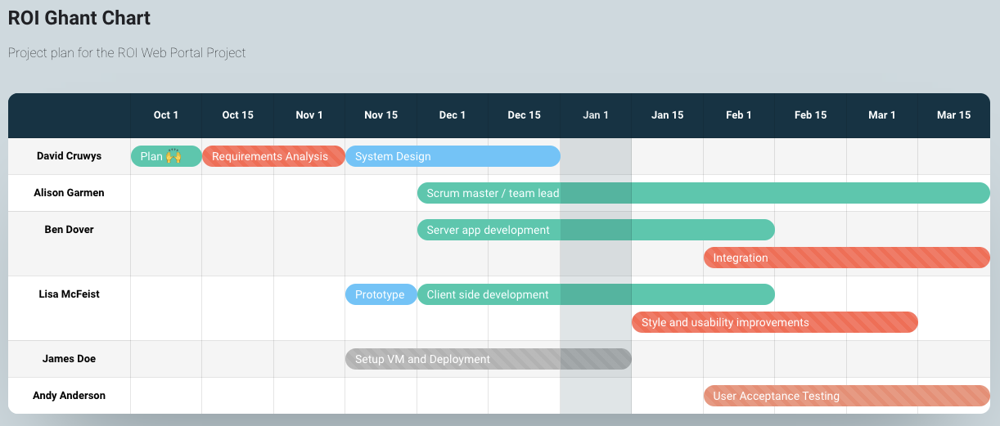

# Project Team - Red Opal/Wiz Biz

Select three suitable team members for the IT development project team 
(refer to Appendix 1 for the developer personas), justifying your selections.

Allocate the project roles listed in the Developer team job descriptions 
(ROI_Developer_team_job_descriptions.pdf) 
and responsibilities based on the requirements of the recommended project solution
 (as identified in the project plan in Assessment 1 Part 5.5) and the team member’s strengths. 
You may create a table/matrix for this information.

|Role|Person|Strengths|
|-|-|-|
|Systems Analyst| David Cruwys | Business Analyst Project Management Scrum Master Application Architecture Diploma of Software engineering |
|Web Developer| Ben Dover | Web Applications Server Architecture Server Development (C#/Rails) HTML/CSS/Javascript DB MsSQL, Diploma of Software engineering |
|Web Developer| Lisa McFeist | Web Applications SPA Applications (React, Angular, Vue) HTML/CSS/Javascript Jest Testing BA of Web Design |
|Software Tester| Andy Anderson | Automation Scripts Business Documentation Data Analytics Worked with WizBiz for 3 years BA of Business |

