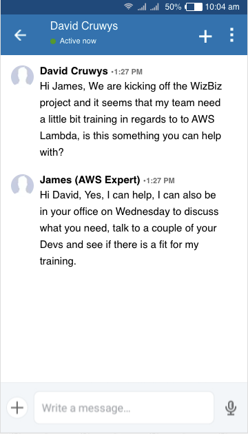
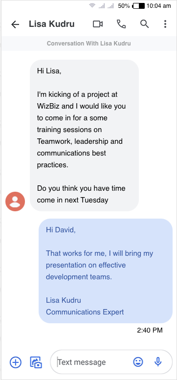
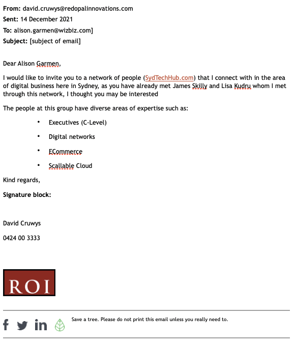

# Knowledge assessment: Project management

**Student details**

Student:  880616253 / David Cruwys

**Student signature and Date**

David Cruwys, 15th Nov, 2021

## Scenario

You are currently employed as a project manager with Red Opal Innovations (ROI) (ROI_Scenario.pdf). You have been assigned the task of managing a project for a new company WizBiz.

Your project plan has been approved and you are ready to execute the project.

Refer to the scenario documents and Organisation standards in Assessment 1.

Download and unzip the resource folder (Cl_ProjMgt_AE_Pro_SR1.zip) to access documents referred to in this assessment.

### Part 1: Commence the project

Refer to Assessment Checklist 1 for the criteria for this part.

There are several tasks that must be done before assembling and meeting your team. 

For each of the following, create a separate word-processed document:

1. Create a logically-sequenced team document for the following, using appropriate language and grammar:

> Prepare a statement of team values and expected behaviour that are in line with the organisational values.
> Note that this will be part of what will used to monitor the team members’ performance in the project.

**see**: [Team Values](./501-project2-part1-A-team-values.md)

2. Select three suitable team members for the IT development project team (refer to Appendix 1 for the developer personas), justifying your selections.

> Allocate the project roles listed in the Developer team job descriptions (ROI_Developer_team_job_descriptions.pdf) and responsibilities based on the requirements of the recommended project solution (as identified in the project plan in Assessment 1 Part 5.5) and the team member’s strengths. You may create a table/matrix for this information.

**see**: [Project Team](./501-project2-part1-B-project-team.md)

3. Some team members may need training or support, which will be determined in the team meeting. So that you can assist them, you need to build your networks of key people and communities with expert skills and knowledge.

> Include details of at least two networks that could be utilised for staff training and upskilling. These may include meetup groups, LinkedIn, or other sources of expertise. Provide screenshots and/or emails (both sent and replied) of your interactions with these networks.

**Conversation** with James Skilly (AWS Expert) on Linked In

**Conversation** with Lisa Kudru (Communications Expert) on WeChat

> Write an email to Alison Garmen, the IT Manager from WizBiz, to invite her to be part of your professional network and discuss how she could be of help with supporting the team. Use the [ROI email template](https://share.tafensw.edu.au/share/items/73f2bb48-c457-4fe9-96cf-618ee5f5f2bc/0/?attachment.uuid=347d5a5d-e8a0-4085-9966-52c261b042de) (ROI_Email_template.docx).

