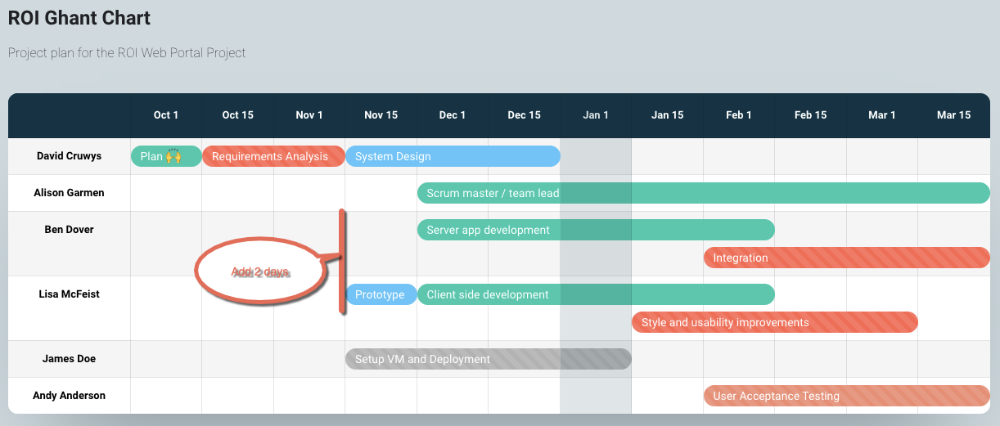

# Knowledge assessment: Project management

**Student details**

Student:  880616253 / David Cruwys

**Student signature and Date**

David Cruwys, 15th Nov, 2021

### Part 3: Monitor and control the project

### Scenario

It is now a week before the development is due to commence according to your project plan. You have received a call from Alison Garmen, the IT Manager from WizBiz, advising the project servers will not be available for another two weeks, which includes your development server.

In addition to the above, you have just been told that a possible integration with some banking software needs to be discussed and two members of your team called in sick today.

You have decided you need to:

- Locate a temporary environment to commence development – possibly the developers’ workstations
- Initiate a meeting to find out more about the potential interface
- Incur delays due to the ill staff; you estimate two days each.
- Update your project plan (from Assessment 1 Part 5) using the project management software tool to reflect the changes outlined in the scenario.
  - This may include the Gantt chart, Communication plan, quality plan, risk register, tasks and costs. 
  - You will also need to create an issues log.

### Issue Log

|Issue| Action |
|-|-|
|Temporary Dev Env| Talk to developers about bootstrapping the server and web application on their local machines|
|Staff Sick| Ben Dover and Lisa McFeist are sick this week, update project plan |
|UX Design| David Cruwys to go over business analyst documents with Lisa McFeist and ask her to start hand drawing user interface mocks |
|Banking Subsystem| Setup a meeting with Alison Garmen to discuss potential banking system |
|Task Breakdown - Addendum | Look at the scope change issues (Banking System, Delays and create an addendum as neeeded) |

### Task breakdown

Name                            | Days        | Cost   | Detail |
--------------------------------|-------------|--------|--------|
Project Plan                    | 5           |   3400 | Develop project plan |
System Analysis & Requirements  | 10          |   6700 | Gather requirements, investigate different solutions |
Systems Design                  | 15          |  10000 | Develop architectural and UX designs       |
Development                     | 50          |  67000 | Develop backed server application Develop client front end          |
Integration & Testing           | 20          |  27000 | Develop integration tests Perform user acceptance tests                  |
Implementation                  | 22          |  30000 | Deployment Backend data feeds Integration to existing systems       |
Operations & Maintenance        | 5           |  34000 | Tech support Hosting        |

### Addendum

Add estimated costs associated with banking integration
Add estimated costs associated with development environment delays

