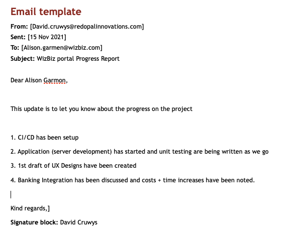

# Knowledge assessment: Project management

**Student details**

Student:  880616253 / David Cruwys

**Student signature and Date**

David Cruwys, 15th Nov, 2021

### Part 5: Manage project activities

> To ensure quality control of the project deliverables, you must monitor the source-control system and manage the system testing.

> Write the email/s to the appropriate person or people to ensure that the system testing activities are scheduled and organised. 
> 

