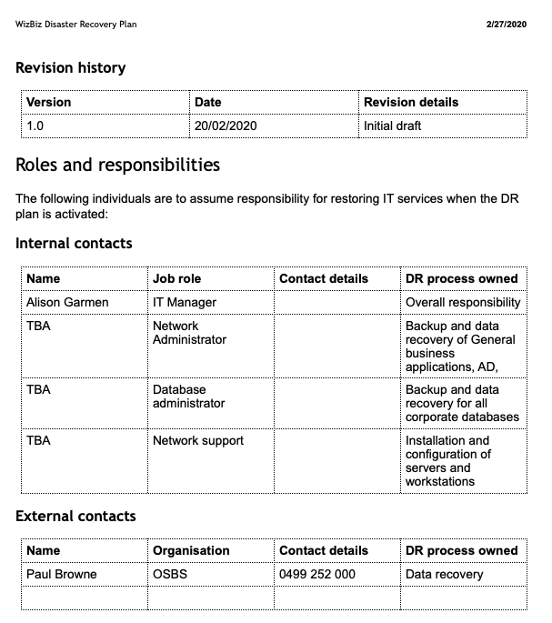

# Knowledge assessment: Project management

**Student details**

Student:  880616253 / David Cruwys

**Student signature and Date**

David Cruwys, 15th Nov, 2021

### Part 6: Hand over the project

> Prepare a project handover report, which includes:

#### Initial support requirements

- System logs will be watched by Lisa McFeist/Ben Dover (Developers) will produce hotfixes for any issues that come up
- Andy Anderson (Software Tester) will be available to our internal users for guidance on how to use the system

#### Ongoing maintenance requirements.

- Support ticketing system needs to be setup with both email and in-site integration.
- 1st level support staff will need to watch for issues

#### Update disaster recovery plan

- Add Lisa McFeist/Ben Dover (Developers) with their phone numbers to the internal contact table.
- Add in a section for version rollback so that both the application and database can be rolled back to an earlier working version.

### Project closure report

#### How it met the requirements

- Business Analysis was performed with key stakeholders.
- Requirements specification was created
- Project plan was created
- Team was assembled
- Project plan was executed
- User acceptance testing was performed
- Support and maintenance workflows were created
- Product was delivered.

#### Opportunities for improvement

- Need to identify and address issues with under performing staff more quickly.
- Need to train our staff on the importance of unit test coverage

#### Lessons learned

- Doing low fidelity mocks was a powerful communication tool for both developers and stakeholders
- Doing data flow diagrams helped developers a great deal

#### Recommendations for future projects

- We need to skill up on writing Infrastructure as Code, maybe have someone do a course in Terraform

#### space for names and signatures of the Project Sponsor and Project Manager.

|Name|**Date**|**Signature**|
| :- | :- | :- |
|**David Cruwys (Project Manager)**|1st Apr| David |
|**Alison Garmen (IT Manager)**|8th Apr| Alison |
|**Gayle Winters (General Manager)**|20th Apr| Gayle |
