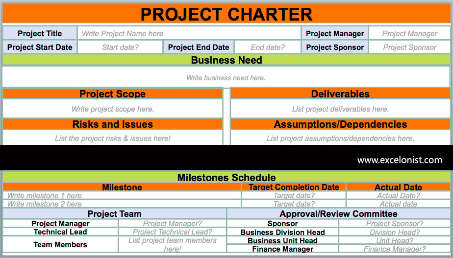
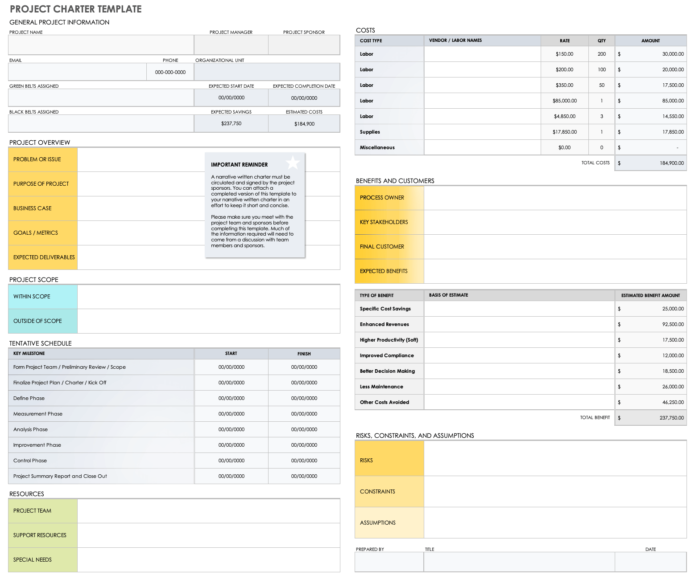

# Develop the project charter - Part 1

**Student details**

Student:  880616253 / David Cruwys

**Student signature and Date**

David Cruwys, 22nd Sep, 2021

## Develop the project charter

**1. Project information**

*Project name*
  - WizBiz Shopping Portal

*Project description*
  - Design, develop and implement the WizBiz online shopping portal

*Expected benefits*
  - Automate customer product search and sales
  - Automate customer on-boarding and product delivery for the business
  
**2. Project governance**

*Project sponsor*

- Sally Smit/Shane Jackson

*Project manager*

- David Cruwys

*Other key stakeholders*

- Vinh Nguyen - ROI Development Manager
- Gayle Winters - General Manager
- Alison Garmen - IT Manager
- Joshua Aspley - Finance Manager
- Annette Wilson - Purchasing Manager
- Phillip Parker - Marketing Manager
- Lillian Groves - Distributions Manager

**3. Problem statement**

Design, develop and implement the shopping portal.

If the project is not a success, the business will fail; without the system, there is no business.

**4. Goals/deliverables**

*Goal*

- Implement a shopping portal for WizBiz

*Objective*

- Identify the shopping portal requirements from the point of view of
  - Customer interaction
  - Staff interaction and tools
  - Business objectives
- Implement customer facing shopping portal

*Project deliverables*

**Phase1**: Portal

- Customer on-boarding
  - Sign-up / Sign-in
  - Approval / Banned
- List of products in categories and segments
- Customer can select a product to order
- Shopping cart maintains a list of products ordered
- Staff can see customer orders

**Phase 2**: Identify future functionality

**5. Scope**

Project has two phases

*Phase 1*: Shopping portal from Customer point of view

*Phase 2*: Shopping portal from Staff and logistics point of view

Phase 1 is in scope, phase 2 is out of scope

Items within scope

- Customer on-boarding
- Display product catalogue
- Customer can select a product to order
- Place the final order from shopping
- Refresh the product catalogue daily
- Privacy & security (meet legislative requirements)

Items outside of scope

- e-commerce / payment gateway.
  - Can use the existing 30, 60 and 90 day accounts model that is already working for us
- Admin portal for maintaining product catalogue
  - We can use the existing spreadsheets

**6. Project approval**

Name            | Stakeholder / Role        | Signature|
----------------|---------------------------|-|
Sally Smith     | Project Sponsor  (Owner)  | [S.Smith]() |
Shane Jackson   | Project Sponsor  (Owner)  | [S.Jackson]() |
David Cruwys    | Project manager           | [D.Cruwys]() |
Vinh Nguyen     | ROI Development Manager   | [V.Nguyen]() |
Gayle Winters   | General Manager           | [G.Winters]() |
Alison Garmen   | IT Manager                | [A.Garmen]() |
Joshua Aspley   | Finance Manager           | [J.Aspley]() |
Annette Wilson  | Purchasing Manager        | [A.Wilson]() |
Phillip Parker  | Marketing Manager         | [P.Parker]() |
Lillian Groves  | Distributions Manager     | [L.Groves]() |

# End of Part 1

**Assesment finishes here**

This extra information below the line is research notes that were useful

## Summary of a what a Project Charter

What is a Project Charter as researched by David

- Summary of problems or opportunities
- Project scope, overview of the work that will be achieved
  - Will deliverables be at once or in phases
  - List what is in and out of scope for the project
- Risks and Assumptions
  - What risks could affect the project
  - Document all assumptions
  - Such as size of development team
- Definition of Success
  - Look at the objectives, opportunities and benefits
  - Success criteria should be measurable
- Project milestones
  - High level summary of the major pieces of work
    - Epics or Initiatives
- Benefits
  - Quantify, e.g. how many hours of employee time will be saved and convert to moneytary value over a year
  - Unquantified, it's important to understand unquantified benefits as well
- Solution Options
  - Each with: Summary, Risk, Assumptions, Ongoing Costs, Rough order of magnitude estimate
  - Highlight the recommend solution
- Rough order of magnitude (ROM Estimate)
  - Guess at all in effort
  - +- 50% based on high level discovery
  - 200 hours on a project means that you can see between 100 and 300 hours being needed for this project
- ROI, Payback Period and Value Proposition
  - ROI = difference between benefits amount and cost of project
  - Payback Period = How long to pay for itself
  - This creates the value Proposition
- Project Team and Stakeholders
  - Executive sponsor (champion)
  - 1 stakeholder per functional area, e.g. HR, Finance, IT, Sales
- Stakeholder sign-off
  - Key stakeholders need to sign-off on project charter

## Sample Templates

