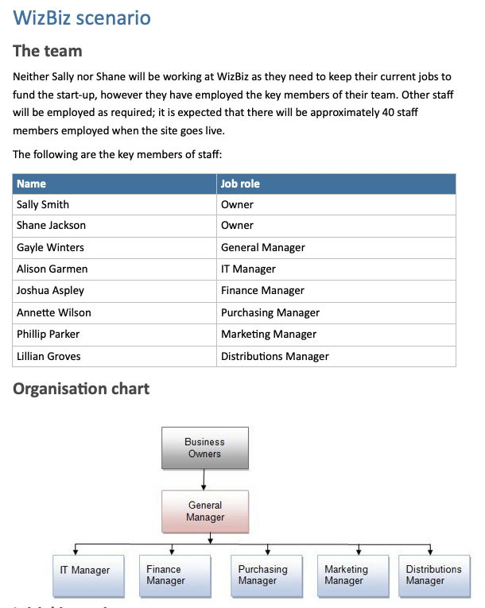

# Part 1 - Develop the project charter

## Project brief/Specifications
The portal will be:

- designed in line with requirements that will be supplied by the key staff
- web based
- hosted internally at a primary site at head office, with a secondary site set up at the distribution centre, which is geographically separate from the head office
- highly scalable, initially supporting up to 1000 transactions a week but able to scale up to at least 50,000 transactions per week
- inclusive of the following key features:
  - Product entry and maintenance
  - Customer access
  - Shopping cart
  - E-commerce
  - Reporting

Security and privacy will be of utmost importance to the business. The system will store details of customers and those required for e-commerce purposes. The business must comply with all relevant standards and requirements under law in Australia with regards to the personal information and payment details.

WizBiz has provided you with the following documentation:

- **Interview responses with management (Interview responses.docx)**
  > This document is missing

- Survey results (Survey results.docx)

- Preliminary retail outlet costs (WizBiz Preliminary Retail outlet costs.xslx).

## Organisational standards

ROI uses the following standards:

- Business reports and documents must use the [*ROI report template*]

## Part 1: Develop the project charter

Scope, objectives and participants

- Summary of problems or opportunities
- Project scope, overview of the work that will be achieved
  - Will deliverables be at once or in phases
  - List what is in and out of scope for the project
- Risks and Assumptions
  - What risks could affect the project
  - Document all assumptions
  - Such as size of development team
- Definition of Success
  - Look at the objectives, opportunities and benefits
  - Success criteria should be measurable
- Project milestones
  - High level summary of the major pieces of work
    - Epics or Initiatives
- Benefits
  - Quantify, e.g. how many hours of employee time will be saved and convert to moneytary value over a year
  - Unquantified, it's important to understand unquantified benefits as well
- Solution Options
  - Each with: Summary, Risk, Assumptions, Ongoing Costs, Rough order of magnitude estimate
  - Highlight the recommend solution
- Rough order of magnitude (ROM Estimate)
  - Guess at all in effort
  - +- 50% based on high level discovery
  - 200 hours on a project means that you can see between 100 and 300 hours being needed for this project
- ROI, Payback Period and Value Proposition
  - ROI = difference between benefits amount and cost of project
  - Payback Period = How long to pay for itself
  - This creates the value Proposition
- Project Team and Stakeholders
  - Executive sponsor (champion)
  - 1 stakeholder per functional area, e.g. HR, Finance, IT, Sales
- Stakeholder sign-off
  - Key stakeholders need to sign-off on project charter
  - 

Refer to Assessment Checklist 1 for the criteria for this part.

Review and analyse the supplied documentation and other relevant sources to develop a project charter.

Your report must use appropriate language and grammar, be presented in a logical sequence and address the following headings and information:

**1. Project information**

- Project name
  - WizBiz Shopping Portal

- Project description
  - Design, develop and implement the WizBiz online shopping portal

- Expected benefits
  - TODO

**2. Project governance**

Names and roles of the:

- Project sponsor
  - Sally Smit/Shane Jackson

- Project manager
  - David Cruwys

- Other key stakeholders
  - Vinh Nguyen - ROI Development Manager
  - Gayle Winters - General Manager
  - Alison Garmen - IT Manager
  - Joshua Aspley - Finance Manager
  - Annette Wilson - Purchasing Manager
  - Phillip Parker - Marketing Manager
  - Lillian Groves - Distributions Manager

The high level scope of the project is to design, develop and implement the shopping portal. If the project is not a success, the business will fail; without the system, there is no business.

You have been provided with a summary of the functional requirements below and access to all the key members of staff as necessary to complete the project. These key members of staff have been meeting for the past two months about the business idea and what role they might play in the business. They each have a good understanding of the business needs as relevant to their role. You have been provided with additional company information and a transcript of the initial interviews with each of the key stakeholders (WizBiz scenario.docx).

**3. Problem statement**

The business problem or opportunity that this project relates to.

**4. Goals/deliverables**

- Goal/s
- Objective/s
- Project deliverables

**5. Scope**

- Items within scope
- Items outside of scope

**6. Project approval**

Name            | Stakeholder / Role        | Signature|
----------------|---------------------------|-|
Sally Smith     | Project Sponsor  (Owner)  | |
Shane Jackson   | Project Sponsor  (Owner)  | |
David Cruwys    | Project manager           | |
Vinh Nguyen     | ROI Development Manager   | |
Gayle Winters   | General Manager           | |
Alison Garmen   | IT Manager                | |
Joshua Aspley   | Finance Manager           | |
Annette Wilson  | Purchasing Manager        | |
Phillip Parker  | Marketing Manager         | |
Lillian Groves  | Distributions Manager     | |

## Summary of a what a Project Charter

What is a Project Charter as researched by David

- Summary of problems or opportunities
- Project scope, overview of the work that will be achieved
  - Will deliverables be at once or in phases
  - List what is in and out of scope for the project
- Risks and Assumptions
  - What risks could affect the project
  - Document all assumptions
  - Such as size of development team
- Definition of Success
  - Look at the objectives, opportunities and benefits
  - Success criteria should be measurable
- Project milestones
  - High level summary of the major pieces of work
    - Epics or Initiatives
- Benefits
  - Quantify, e.g. how many hours of employee time will be saved and convert to moneytary value over a year
  - Unquantified, it's important to understand unquantified benefits as well
- Solution Options
  - Each with: Summary, Risk, Assumptions, Ongoing Costs, Rough order of magnitude estimate
  - Highlight the recommend solution
- Rough order of magnitude (ROM Estimate)
  - Guess at all in effort
  - +- 50% based on high level discovery
  - 200 hours on a project means that you can see between 100 and 300 hours being needed for this project
- ROI, Payback Period and Value Proposition
  - ROI = difference between benefits amount and cost of project
  - Payback Period = How long to pay for itself
  - This creates the value Proposition
- Project Team and Stakeholders
  - Executive sponsor (champion)
  - 1 stakeholder per functional area, e.g. HR, Finance, IT, Sales
- Stakeholder sign-off
  - Key stakeholders need to sign-off on project charter
  - 
