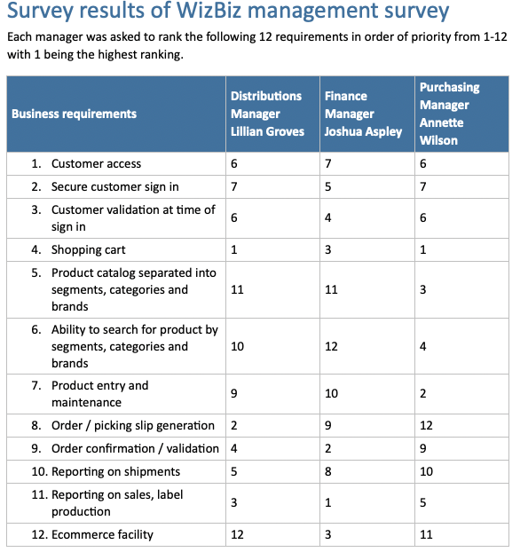
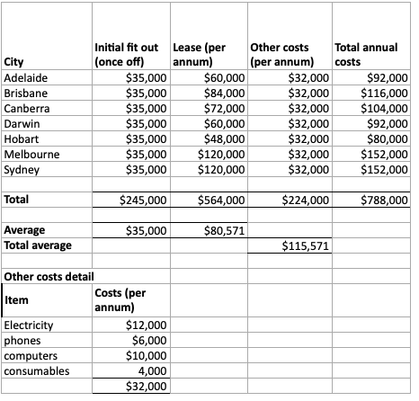
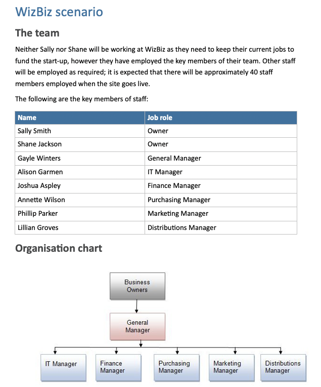

# Prepare to gather data - Part 2

**Student details**

Student:  880616253 / David Cruwys

**Student signature and Date**

David Cruwys, 22nd Sep, 2021

## Prepare to gather data

### Plan four suitable information gathering activities

Plan at least four suitable information gathering activities that will help you to determine the project requirements, constraints and risks.

1. General Q&A with stack holders
2. Identify needs vs wants
3. List of all WizBiz documents
4. Review and identify useful documents

### General Q&A Session with stack holders

Collaborate with multiple stack holders and ask purposeful questions that understand the points of view from different people

### Identify needs vs wants

The primary goal is that WizBiz has a customer portal so they can scale up customer orders.

Here a list of features for Customers and Staff

Customer features

- Web portal where they can search the catalogue
- Select specific products
- Place an order
- Pay for the order

Staff features

- Able to update catalogue
- Manage inventory
- Ship orders
- Process payments

#### Needs

In keeping with the primary goal of scaling up customer orders, Phase 1 of the project should deliver the following capabilities.

Customer needs

- Customer on-boarding
  - Sign-up / Sign-in
  - Privacy & security - Meet the legislative requirements
- Web portal catalogue
- Basic search capability
- Add/remove product from shopping cart
- Place order

Staff needs

- Refresh the product catalogue daily
- Can see list of orders

#### Wants

Wants can be delivered in future phases

- E-Commerce
  - Payment gateway

*WizBiz currently have an accounts department dealing with 30, 60, 90 day and on-demand payments, using phone, fax and email*

**Manage Customers**

  - Approve / Ban
  - Communicate with customers

*Currently have a sales department and account managers, currently using email, fax and phone*

**Manage Catalogue**

- Create categories and segments
- Add product listings
- Alter inventory / stock levels plus availability

*Currently have spreadsheets that we can turn into a JSON feed*

**Manage Orders**

- Orders to be fulfilled
- Packing slips
- Order delivery confirmations
- Order tracking

### List of all WizBiz documents

|**Document Title** |**Notes**|
| :- | :- |
| WizBiz Strategic Plan.pdf | Description, goals and mission statement for company |
| WizBiz scenario.docx | Project brief plus kickoff information from key stakeholders |
| WizBiz Preliminary Retail outlet costs.xlsx |  |
| WizBiz Disaster Recovery Plan.docx | Guidelines, and sign-off sheets in case of Disaster |
| Survey results.docx | Survey on WizBiz website portal from point of view of major stakeholders |

### Review and identify useful documents

#### Survey on WizBiz

Survey on WizBiz website portal from point of view of major stakeholders will be useful to identity requirements

#### Costs

Preliminary Retail outlet costs can be used to calculate ROI for the Web Portal

#### Stakeholders and brief

This document contains the project brief plus kickoff information from key stakeholders.

# Include a bibliography of resources you use for research, including organisational documentation.

* Organisation documents have been used to infer informdation for the project. See: **List of all WizBiz documents**
* Stake holder interviews have conducted and documented. See: **Q&A Session with stack holders**
* Phone interviews with potential users including
  * Accounts department
  * Logistics department
  * Sales department
  * Existing customers

