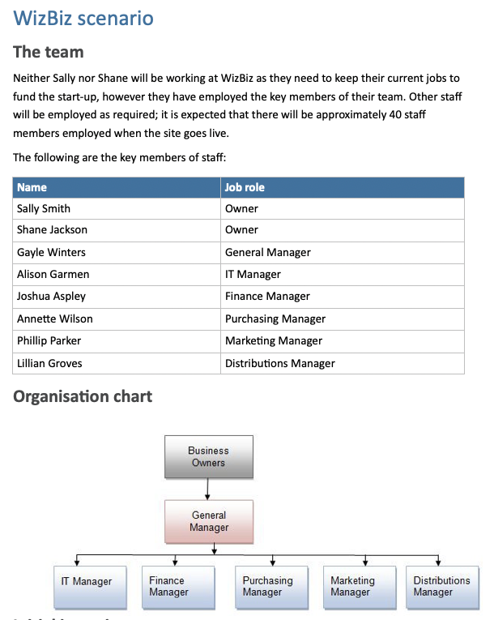
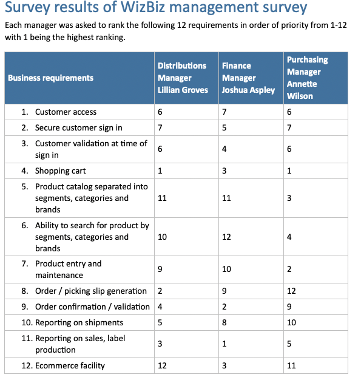
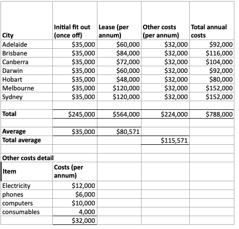
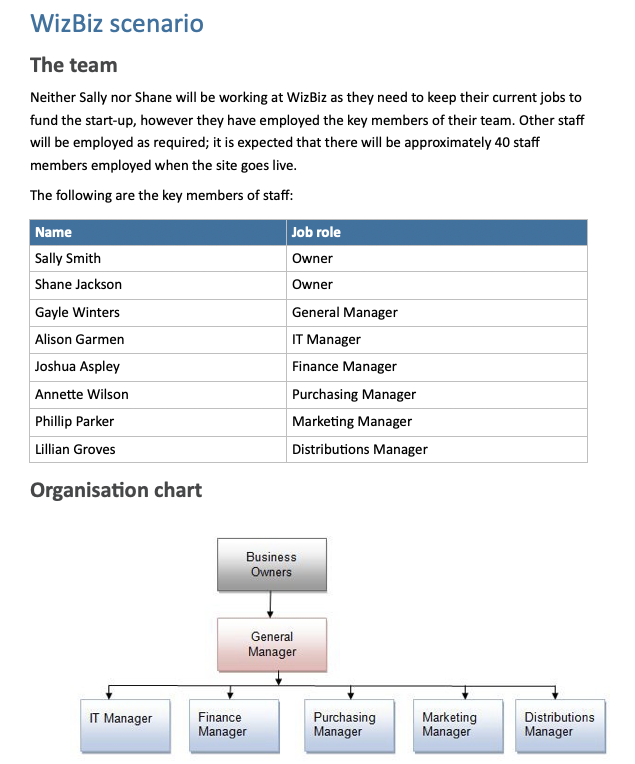
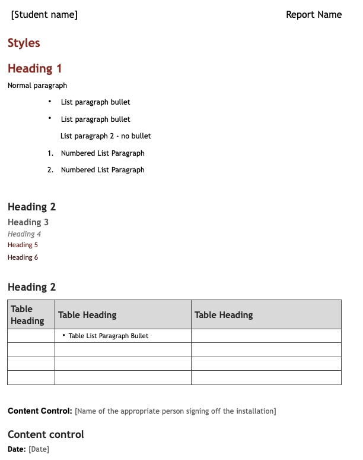

# Develop the business case - Part 4

**Student details**

Student:  880616253 / David Cruwys

**Student signature and Date**

David Cruwys, 22nd Sep, 2021

### Assessment Criteria

xxxxxxxxxxxxxxxxxxxx

## Develop the business case

### Project information

 the name of the person preparing the business case, the sponsor’s name and the date it was prepared.

*Project name*
  - WizBiz Shopping Portal

*Project manager*
  - David Cruwys

*Project sponsor*
  - Sally Smith / Shane Jackson

*Date*
  - 22nd Sep, 2021

### Executive summary

In communication sessions with WizBiz execs, they expressed a desire to handle increased competition, scale their customer base and 10x their business.

The existing model of brick and mortar stores, whilst profitable, come with large investment, slow ROI and don't scale.

New local and overseas competitors are increasing market share because of there online only approach with low overhead and high margin.

We have decided to enter the online only space, whilst maintaining the benefits of our existing brick and mortar businesses and brand equity.

### Overview

Design, develop and implement the WizBiz shopping portal.

Cut costs associated with the existing brick and mortar stores and open up to larger market of customers.

### Feasibility

Project feasibility areas:

**Technical capability**

WizBiz currently have in house team including IT manager, networking staff, application support staff and a wordpress webmaster.

ROI has internal development team including web developer, technical writer, content developers and systems analyst.

**Financial resources**

Budget for the project is $150,000.00. 

This is just for the web portal, there are additional budges for hardware, support and maintenance and telecommunications.

**Legal requirements**

The system will store details of customers and those required for e-commerce purposes. The business must comply with all relevant standards and requirements under law in Australia with regards to the personal information and payment details.

Web portal will require the following:

- Have a Privacy Policy 
- Have a Terms and Conditions
- Collect only personal information required to deliver our services
- Have Privacy Compliance System in place with ability to securely destroying information that is not used in a "reasonable" amount of time

[Australian Guidelines for eCommerce](https://treasury.gov.au/sites/default/files/2019-03/australian_guidelines_for_electronic_commerce.pdf)

**Operational**

The WizBiz portal provides a new avenue for marketing existing products and services.

We already have phone and email sales team, accounting and payment systems, warehousing and delivery / logistics operations in place.

The WizBiz portal is just a layer on top of these existing business operations.

**Scheduling**

Below is a simple schedule, see the project plan and ghant for more detail

- Build a project plan
- Identify required resources
- Hire any identified external contractors
- Execute on the project plan
- Deploy the system
- Run User Acceptance Testing using internal staff and preferred customers
- Open up for general access

### Business requirements

Implement a shopping portal that allows WizBiz to handle increased competition, scale their customer base and 10x their business.

### Options

The team currently has a good idea of what an in-house solution would look and has evaluated a solution from a one of our smaller competitors `PureBiz Inc`

Using ideas from that solution plus our own in house requirements, we know clearly what is needed.

We have considered approaching `PureBiz Inc`, for either licencing or even trying to acquire them outright, but those idea is on hold.

We have looked at off the shelf solutions from Magneto and Shopify, but we realize much of the solution requires tight integration with existing brick and mortar and logistics systems that are already developed internally.

### Resource needs

Explain what resources are needed for the project and why, including the following policies and processes:

| Type of Resource | Person |
|-|-|
| Project Manager | David Cruwys |
| Requirements Analysis and Specification | David Cruwys |
| Web Application Developer | TBA |
| Development manager | Alison Garmen |
| Legal and Compliance Sign off | WizBiz Laywer|
| New hardware | Alison Garmen |
|  | |

1. Outline the organisational project governance policies and processes that apply to this project (previously confirmed with the client in Part 3)

> @Nicholas: I don't understand this question? especially in the context of resources.

  [Guidelines for Governance and policies](ROI_Code_of_Conduct.pdf)

2. Outline the project cash flow and budgeting processes.

### Analysis

Analyse the recommended solution and discuss the following:

### Expected benefits to WizBiz

Cut infrastructure costs, retail rental spaces, store fit outs, ancillary costs associated with brick and mortar business.

Expand presence and shopping opportunity to people not near a WizBiz franchise.

Potential to scale the business with minimal increase in costs.

Able to match competitors in terms of price and availability.

### Costs

#### Investment

$150,000 is allocated to build the WizBiz portal

#### Return on investment

Retail store costs:

- First year: $147,571
- On-going cost after year 1: $115,571

*note* these costs are on a per store basis and we currently have 7 stores

- On-going cost (all stores) per annum: $808, 997

Store revenue:

- Revenue average per store: $580,000
- 7 Stores: $4,060,000

WizBiz Portal build cost:

- Initial build cost: $150,000

Projected revenue (first year): $200,000

#### Success criteria/key metrics

- Catalogue is available online
- Customer on-boarding/sign up
- Products can be added to shopping cart
- Order can be placed

#### Financial projections

- On-going support cost (per annum): $45,000 and increasing with more users
- On-going new feature development (per annum): $100,000 and increasing as we grow the platform
- Projected revenue each year as platform grows

|Costs|Year 1|Year 2|Year 3|Year 4|
|-|-|-|-|-|
|Build|150,000||||
|Support|45,000|65,000|85,000|100,000|
|New Features||100,000|150,000|300,000|
|IAAS|5,000|7,000|9,000|11,000|
|**Total**|200,000|152,000|154,000|156,000|
|-|-|-|-|-|
|**Revenue**|**Year 1**|**Year 2**|**Year 3**|**Year 4**|
|Support|200,000|800,000|1,600,000|3,200,000|
|**Cash flow**|**Year 1**|**Year 2**|**Year 3**|**Year 4**|
||0|648000|1446000|3044000|

ROI: 100% for first year

- An overview of milestones/key activities and expected timelines

|Date|Milestone|
|-|-|
| End of Jan | Online catalogue and customer on-boarding |
| Feb 1st | Limited UAT and feedback |
| End of Feb | Shopping cart and order placement |
| March 1st | Limited UAT and feedback |
| March 15th | Limited Customers to start placing real orders |
| April 15th | Open up the system to everyone |

### Risks

- Building software is a not a core strength for either IT department or the managers at WizBiz
- Software may not deliver functionality as dreamed by the founders
- Unexpected costs due to delay or IT infrastructure
- Change management with the various departments (Logistics, Accounting, Sales)
- Scope creep

### Constraints

- $150,000 for the software build
- Limit the scope to just delivery the portal as an MVP

### Assumptions

- ROI will be able to use their own staff and contractors to deliver the project.
- Experienced eCommerce developer will be available.
- WizBiz portal will have similar revenue in year one as the larger retails stores in Sydney and Melbourne.

### Conclusion

Write a suitable conclusion.

###. Bibliography

Include a bibliography of resources you use for research, including organisational documentation.

- [Scenario](./images/scenario.png)
- [Survey](./images/survey.png)
- [Costs](./images/costs.png)
- [Stakeholders](./images/stackholders.png)
- [Reporting Template](./images/report-template.png)

