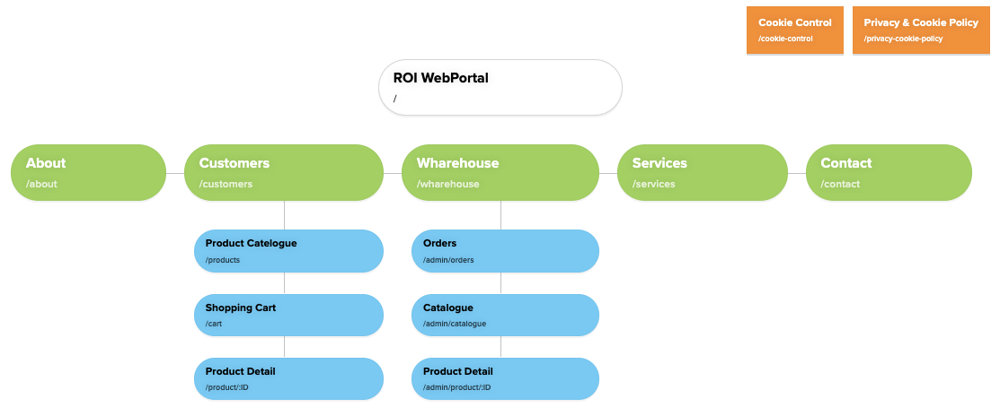

# Develop the business case - Part 5

**Student details**

Student:  880616253 / David Cruwys

**Student signature and Date**

David Cruwys, 22nd Sep, 2021

## Prepare the project plan

### Project information

 the name of the person preparing the business case, the sponsor’s name and the date it was prepared.

*Project name*
  - WizBiz Shopping Portal

*Project manager*
  - David Cruwys

*Project sponsor*
  - Sally Smith / Shane Jackson

*Date*
  - 22nd Sep, 2021

### Project Phases

- Plan
- System Analysis & Requirements
- Systems Design
- Development
- Integration & Testing
- Implementation
- Operations & Maintenance

### Task breakdown

Name                            | Days        | Cost   | Detail |
--------------------------------|-------------|--------|--------|
Project Plan                    | 5           |   3400 | Develop project plan |
System Analysis & Requirements  | 10          |   6700 | Gather requirements, investigate different solutions  |
Systems Design                  | 15          |  10000 | Develop architectural and UX designs       |
Development                     | 50          |  67000 | Develop backed server application Develop client front end          |
Integration & Testing           | 20          |  27000 | Develop integration tests Perform user acceptance tests                  |
Implementation                  | 22          |  30000 | Deployment Backend data feeds Integration to existing systems       |
Operations & Maintenance        | 5           |  34000 | Tech support Hosting        |

### Stackholder roles & responsibilities

Name            | Stakeholder / Role        
----------------|---------------------------
Sally Smith     | Project Sponsor  (Owner)  
Shane Jackson   | Project Sponsor  (Owner)  
David Cruwys    | Project manager           
Vinh Nguyen     | ROI Development Manager   
Gayle Winters   | General Manager           
Alison Garmen   | IT Manager                
Joshua Aspley   | Finance Manager           
Annette Wilson  | Purchasing Manager        
Phillip Parker  | Marketing Manager         
Lillian Groves  | Distributions Manager     

### Development Team

Name            | Resource                  | Specialty |
----------------|---------------------------|-|
David Cruwys    | Project manager           | Project Manager Business Analyst|
Alison Garmen   | IT Manager                | Scrum Master |
Ben Dover       | Server Developer          | C# Developer |
Lisa McFeist    | Client Developer          | React Developer |
James Doe       | Network Infrastructure    | Cloud IAAS |
Andy Anderson   | Testing                   | User Acceptance Testing |

### Schedule (Gantt chart).

### Detailed Budget

A detailed budget for the project, including a contingency amount.

Time estimates for each project phase has been estimated

The cost of each development team member is similar and so costs have been simplified down to a resource per day cost.

e.g. 1 day of work from a developer or a business analyst has been averaged out to $670 / per day.

There is a 4 month deadline for going live (Oct 1 - March 15) and 112 working days

### Communication plan

Project planning will use clickup.com

- Backlog grooming by project manager

Development communication will be via 2 week SCRUM with daily standup and 4 ceremonies

- Sprint planning.
- Daily scrum.
- Sprint review.
- Sprint retrospective.

Stack Holder communication will be via email and Zoom.

Weekly risk report emailed to key stakeholders

### Quality management plan

Addressing a minimum of three controls that will be implemented to assure quality.
This must include how the system testing will be managed.

1. Server application will unit test for data and business logical
2. User Acceptance tester will develop a test coverage plan
3. Polling services such as uptime.com will be configured to watch and notify service uptime

### Risk register.

#### Communication template

#### Risk Categories

### Create system overview models:

#### Level 2 context diagram

### Site map of website.

### Project Sign off

Name            | Stakeholder / Role        | Signature|
----------------|---------------------------|-|
Sally Smith     | Project Sponsor  (Owner)  |  |
Shane Jackson   | Project Sponsor  (Owner)  |  |
David Cruwys    | Project manager           | [D.Cruwys]() |
Vinh Nguyen     | ROI Development Manager   | [V.Nguyen]() |
Gayle Winters   | General Manager           |  |
Alison Garmen   | IT Manager                |  |
Joshua Aspley   | Finance Manager           | [J.Aspley]() |
Annette Wilson  | Purchasing Manager        |  |
Phillip Parker  | Marketing Manager         | [P.Parker]() |
Lillian Groves  | Distributions Manager     |  |

