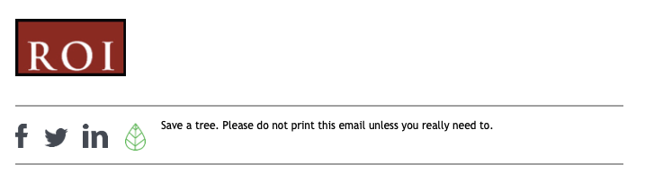
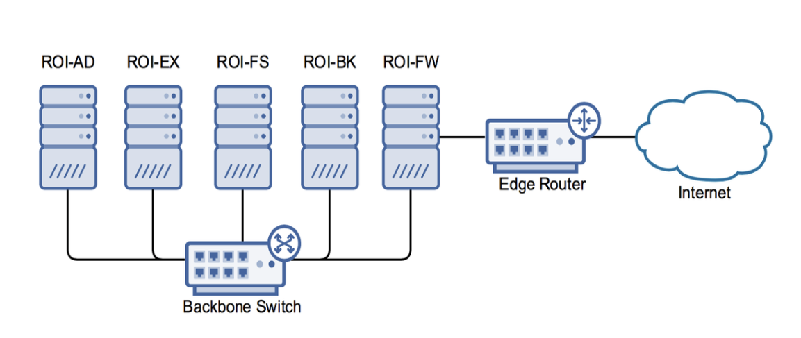

# Gather data to identify business requirements - Part 2

**Student details**

Student:  880616253 / David Cruwys

**Student signature and Date**

David Cruwys, 2nd Aug, 2020

## Gather data

[Summarisation of resources](./509-assessment-summary.md)

### Step 2.1 – Document Review

Analyse the document and then describe the business information contained in this document that is relevant to the project. Point form is sufficient. 

|**Repository**|**Document Title** |**Information** |
| :- | :- | :- |
|Operations|ROI Scenario .pdf|Overview of Red Opal Innovations (ROI), historical and department information|
|IT|ROI Scenario add info 1 .pdf|Historical information; Description of IT infrastructure problem; Information about the infrastructure setup (server, LAN, proxy, firewall and ISP + Plan)|
|IT|ROI Scenario add info 2.pdf|Project requirements and scope|
|IT|ROI Data Analysis Report template.dotx|Template for filling out the complete data analysis report about the company and project, see [509 - data analysis report](./509-data-analysis-report.md)|
|Sales / Marketing|ROI Style guide.pdf|Branding guidelines, Web and print media guides for Logo, Typography, Colour, Images|
|Sales / Marketing|ROI Email template.docx|Email guidelines, Template for sending emails|
|IT|ROI IT Gov policy|List of major stakeholders plus rules (Principles) on new IT projects|
|IT|ROI IT Infr change survey results.pdf|Virtualisation is being implemented by many organisations and the IT Support Network Manager of Red Opal Innovations, Terrence Stewart, is interested in exploring the possibility of introducing virtualised servers at Red Opal Innovations.|
|IT|ROI NW server register.pdf|List of all 5 servers, their purpose and services they offer, specifications, network diagram|
|Operations|ROI Org chart.pdf|Organisation chart|
|IT|ROI Strategic plan.pdf|IT Strategic Plan|
|IT|ROI SLA.pdf|SLA - Service Level Agreement IT Support|
|Accounts|ROI_Asset_register.xlsx|List of computers and other assets|
|IT|ROI_NW_server_register.pdf|Servers, Network Diagram, Ports|

### Step 2.2 –  Interview – Role play

Done in class

### Step 2.3 - Confirm interview results

Done in class

### Step 2.4 –  Meeting – Role play

Done in class

### Step 2.5 - Confirm meeting results

**From**: david.cruwys@redopalinnovations.com
**Sent**: 27/Oct/2021
**To**: wendy.opal@redopalinnovations.com
**Subject**: Server Infrastructure Upgrade

Dear Wendy Opal,

This email outlines the general requirements for expanding your existing server infrastructure to new virtualisation technologies

Your current infrastructure is an internal network architecture using 5 servers.

With the move to the new location, we are going to provide an expansion path that replaces Domain Controller Server with new virtualizing technologies that are scalable with your planned business growth

The new virtualisation servers will host the existing servers and have easy expansion capability.
In-house and external connections will be 10 times faster then existing setup using FTTP (fibre to the premises).
Mobile work environments will be available over a secure VPN allowing remote staff to access the network whilst maintaining high security.

Budget: **$150,000**

Please reply with confirmation that this information is correct. 

Kind regards,
*David Cruwys*
*0400 001122*

### Step 2.6 –  Current system  

|**Hardware** |
| :- |
| 3 x Dell PowerEdge R210 II |
| 2 x HPE ProLiant DL380 Gen9 E5-2660v4 |
|**Software**|
| MS Server 2008r2 |
| MS Server 2012 |
| MS Exchange |
| SAP |
| HRMS |
| |
|**Networking**|
| ROI-AD **IP**: *10.0.1.4* - Domain Controller, Print Server|
| ROI-EX **IP**: *10.0.1.5* - Email, Finance Server, HR |
| ROI-FS **IP**: *10.0.1.10* - File Server |
| ROI-BK **IP**: *10.0.1.8* - Backup Server |
| ROI-FW **IP**: *10.0.1.6* - Proxy, Firewall |
|**Current network diagram**|
|  |

### Step 2.7 –  Research  

##### Scenario

*One major aspect of the project relates to using a new server to host the existing servers in a virtual environment. Your manager, Terrence Stewart Network Manager and IT Support, has asked you to research possible servers that would be suitable for this business requirement.*

*Hosting the existing servers in a virtual environment will require virtualisation software. Terrence has also asked you to research possible virtualisation software that would be suitable for this business requirement.*

*Terrence would also like to know how long it will take for the company to recoup the cost of a \$30,000 new server. It is estimated that the saving from implementing the new server will be an average of $10,000 per year.* 

*ROI Management would like to compare investing the \$30,000 in a new server with investing the $30,000 in a term deposit. This term deposit would be for 5 years with an interest rates of 3% compound.*

| Server Options |
| :- |
| **Lenovo - ThinkSystem SR665 - $6,879.41** |
| The [ThinkSystem SR665](https://www.lenovo.com/au/en/data-center/servers/racks/ThinkSystem-SR665/p/7D2VA034AU) - 7252 - 16GB delivers the next era of solution performance for software-defined workloads, Big Data, VDI, and Databases to match modern data centers’ demands for ever-expanding capability and performance. Maximize server utilisation and decrease network bottlenecks with 128 processor cores from two AMD EPYC™ CPUs, class-leading memory speed and 128 PCIe 4.0 lanes.| 
| **Dell - PowerEdge R250 - $10,646.50** |
| The [PowerEdge R250](https://www.dell.com/en-au/work/shop/cty/pdp/spd/poweredge-r250/asper250_vi_vp), powered by the Intel® Xeon® E-2300 processors, is a rack server with an ideal balance of adaptability and affordability designed to address your evolving compute demands. Supports up to 32GB DIMMS at 3200 MT/s DIMM speed, up to 128GB Address substantial throughput improvements with PCIe Gen 4 support Ideal for file/print, mail/messaging, point of sale, web hosting and collaboration Offers enhanced thermal efficiency Provides improved security and faster boot time with UEFI Secure Bootd |

**Virtualisation Software**

**Microsoft Hyper-V** is available as part of Microsoft server 2020

[Hyper-V](https://docs.microsoft.com/en-us/windows-server/virtualization/hyper-v/hyper-v-technology-overview) is allows you to run multiple virtual machines on top of Microsoft Server. Each machine has its own isolated space, which means we can run more than one virtual machine on the same hardware at the same time

- Establish or expand a private cloud environment on demand
- More effective hardware use. We can consolidate our servers and workloads onto fewer, more powerful physical computers to use less power and physical space.
- Provide virtual desktop infrastructure (VDI) so that staff have a consistent desktop experience, this will provide business agility, data security and simplify regulatory compliance and manage desktop operating systems and applications.
- Being a Microsoft product, this solution integrates well with existing Microsoft software such as Office, Exchange etc.

**VMWare - vSphere 7**

[vSphere](https://www.vmware.com/au/products/vsphere.html) Power our computing environment for modern applications using any combination of virtual machines, containers and Kubernetes with VMware vSphere.

As with Hyper-V, we would get

- Establish or expand a private cloud environment on demand
- More effective hardware use. We can consolidate our servers and workloads onto fewer, more powerful physical computers to use less power and physical space.

If we need to host any new server applications, this becomes really simple as we have the flexibility to configure servers built from docker style containers

Cons: Because it is not Microsoft, we will have more work to virtualize our existing Microsoft Infrastructure

### Step 2.8 –  Analyse Financial Information  

\$30,000 invested at 3% per annum

Interest Earned on $30,000 would be:

P = 30000.
r = 5/100 = 0.05
n = 12 periods per year
t = 3 years

A = 30,000 (1 + 0.03 / 12) (12 * 3) = $2,821.54

Value at year 3 (\$32,821.54)

Revenue (as a cost reduction) is \$10,000 per annum for 1x$30,000 Server

The server would pay for itself in 3year, 4 months.

From this period onwards, there will be an extra $10,000 per annum in cost reductions, clear.

The ROI on the investment is 33.3% per annum vs 3% offered by the bank.
