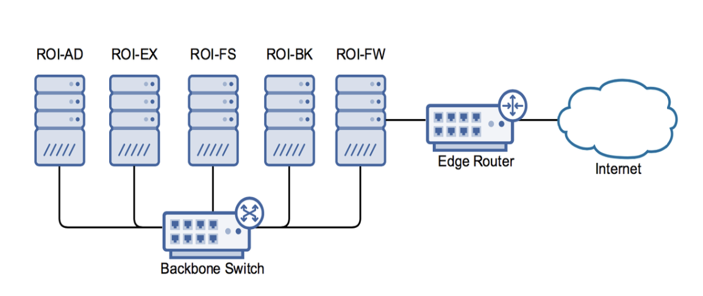

# Gather data to identify business requirements - Part 3

**Student details**

Student:  880616253 / David Cruwys

**Student signature and Date**

David Cruwys, 2nd Aug, 2020

## Data analysis report

[Summarisation of resources](./509-assessment-summary.md)

### Step 3.1 – Data analysis report

Document the findings of your information gathering and analysis in a formal Report

# ROI Data Analysis Report

## Virtualisation Project

### Introduction

ROI has experienced 7 seven years of steady growth of 5-10% per year.

In the last couple of years, growth is now %20-%30, profits are strong, but the existing IT infrastructure is outdate and not coping with organisational growth.

### Project brief

A budget of \$150,000 has been set aside for an IT Infrastructure project to go in effect as we move to a new premise.

This budget should cover a new server, virtualisation software, network infrastructure and workstations.

### Background

#### ROI

Red Opal Innovations (ROI) is an information technology company.

Starting in 2004, the company focused on IT and network consultancy services for small to medium sized businesses.

In the last three years, ROI has added services for website design and development, multimedia production and custom applications.

Current, ROI employs 40 full time staff and a flexible workforce of with up to 20 contractors to cover specific projects.

#### Strategic directions

Summarise the components of the company’s Strategic Directions relevant to the project. 

#### Current ICT systems

**Hardware**

- 3 x Dell PowerEdge R210 II |
- 2 x HPE ProLiant DL380 Gen9 E5-2660v4 |

**Software:**

MS Server 2008r2, MS Server 2012, MS Exchange, SAP, HRMS

|**Current network diagram**|
|  |

Summarise the current ICT systems. Include a diagram of the current network.
– Use the information determined in Part 2 Step 2.6 a)

### Information gathering methodology

#### Stakeholders

 - Wendy Opal - CEO
 - David Cruwys - Project Manager
 - Amy Corgan - HR
 - Max Boags - Accounts
 - Vinh Ngyen - Development
 - Frank Marks - Multimedia
 - Sally Bach - Sales & Marketing
 - Terrence Stewart - Network/IT Support Key
 - Customers
 - Staff

#### Methodology

- One on one interviews with taken with key stakeholders, Wendy Opal, Vinh Ngyen and Terrance Stewart

- Information gathering questionnaires were provided using JotForms to all stakeholders 
  - Wendy Opal, Vinh Ngyen, Max Boags, Amy Corgan, Frank Marks and Sally Bach.

- Informal questioning was taken with 5 random staff members

- Brainstorming meeting was finally done after all information was gathered and analysed to validate and find any missing ideas.

### Data Analysis
   
#### Business requirements

Analyse the group and individual responses, along with other information sources, to determine the business requirements.

List and describe these business requirements in order of priority.

### Conclusion**

#### Bibliography

List all references used in gathering information and compiling this report. Include both internal (company documents) and external (research) information sources. Use APA referencing style.

1. **Appendices**
   1. **Documentation review results**

– Use the information determined in Part 2 Step 2.1

1. **Interview results**

– Use the information determined in Part 2 Step 2.3

1. **Meeting results**

– Use the information determined in Part 2 Step 2.5

1. **Research results**

– Use the information determined in Part 2 Step 2.7 a & b

|**STEP #**|**Instructions**|**S**|**U/S**|**Assessor Comments**|
| :- | :- | :- | :- | :- |
|**3.1.1**|Analyse group and individual responses to clearly define business priorities|||
*Date of Observation:*

*Assessors are to record their observations in sufficient detail to demonstrate their judgement of the student’s performance against the criteria.*
|
|**3.1.2**|Review and analyse business requirements based on business strategy and current and future directions|||
*Date of Observation:*

*Assessors are to record their observations in sufficient detail to demonstrate their judgement of the student’s performance against the criteria.*
|
|**3.1.3**|Prepare data for review|||
*Date of Observation:*

*Assessors are to record their observations in sufficient detail to demonstrate their judgement of the student’s performance against the criteria.*
|
|**3.1.4**|Document data analysis for review according to organisational standards|||
*Date of Observation:*

*Assessors are to record their observations in sufficient detail to demonstrate their judgement of the student’s performance against the criteria.*
|
|**3.1.5**|Uses vocabulary, grammatical structures, terminology, diagrams, numerical information, formatting and structure relevant to the job role and organisation to document the analysis|||
*Date of Observation:*

*Assessors are to record their observations in sufficient detail to demonstrate their judgement of the student’s performance against the criteria.*
|
