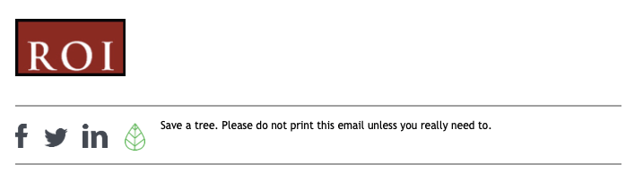

# Gather data to identify business requirements - Part 3

**Student details**

Student:  880616253 / David Cruwys

**Student signature and Date**

David Cruwys, 2nd Aug, 2020

## Data analysis report

[Summarisation of resources](./509-assessment-summary.md)

### Step 3.1 – Data analysis report

Document the findings of your information gathering and analysis in a formal Report

# ROI Data Analysis Report

## Virtualisation Project

### Introduction

ROI has experienced 7 seven years of steady growth of 5-10% per year.

In the last couple of years, growth is now %20-%30, profits are strong, but the existing IT infrastructure is outdate and not coping with organisational growth.

### Project brief

A budget of \$150,000 has been set aside for an IT Infrastructure project to go in effect as we move to a new premise.

This budget should cover a new server, virtualisation software, network infrastructure and workstations.

### Background

#### ROI

Red Opal Innovations (ROI) is an information technology company.

Starting in 2004, the company focused on IT and network consultancy services for small to medium sized businesses.

In the last three years, ROI has added services for website design and development, multimedia production and custom applications.

Current, ROI employs 40 full time staff and a flexible workforce of with up to 20 contractors to cover specific projects.

#### Strategic directions

Summarise the components of the company’s Strategic Directions relevant to the project. 

#### Current ICT systems

**Hardware**

- 3 x Dell PowerEdge R210 II |
- 2 x HPE ProLiant DL380 Gen9 E5-2660v4 |

**Software:**

MS Server 2008r2, MS Server 2012, MS Exchange, SAP, HRMS

|**Current network diagram**|
|  |

### Information gathering methodology

#### Stakeholders

 - Wendy Opal - CEO
 - David Cruwys - Project Manager
 - Amy Corgan - HR
 - Max Boags - Accounts
 - Vinh Ngyen - Development
 - Frank Marks - Multimedia
 - Sally Bach - Sales & Marketing
 - Terrence Stewart - Network/IT Support Key
 - Customers
 - Staff

#### Methodology

- One on one interviews with taken with key stakeholders, Wendy Opal, Vinh Ngyen and Terrance Stewart

- Information gathering questionnaires were provided using JotForms to all stakeholders 
  - Wendy Opal, Vinh Ngyen, Max Boags, Amy Corgan, Frank Marks and Sally Bach.

- Informal questioning was taken with 5 random staff members

- Brainstorming meeting was finally done after all information was gathered and analysed to validate and find any missing ideas.

### Data Analysis
   
#### Business requirements

Analyse the group and individual responses, along with other information sources, to determine the business requirements.

List and describe these business requirements in order of priority.

### Conclusion

#### Bibliography

**Documentation review results**

| **Author** |**Document Title** |**Information** |
| :- |:- | :- |
| ROI | Scenario .pdf|Overview of Red Opal Innovations (ROI), historical and department information|
| ROI | Scenario add info 1 .pdf|Historical information; Description of IT infrastructure problem; Information about the infrastructure setup (server, LAN, proxy, firewall and ISP + Plan)|
| ROI | Scenario add info 2.pdf|Project requirements and scope|
| ROI | Data Analysis Report template.dotx|Template for filling out the complete data analysis report about the company and project, see [509 - data analysis report](./509-data-analysis-report.md)|
| ROI | Style guide.pdf|Branding guidelines, Web and print media guides for Logo, Typography, Colour, Images|
| ROI | Email template.docx|Email guidelines, Template for sending emails|
| ROI | IT Gov policy|List of major stakeholders plus rules (Principles) on new IT projects|
| ROI | IT Infr change survey results.pdf|Virtualisation is being implemented by many organisations and the IT Support Network Manager of Red Opal Innovations, Terrence Stewart, is interested in exploring the possibility of introducing virtualised servers at Red Opal Innovations.|
| ROI | NW server register.pdf|List of all 5 servers, their purpose and services they offer, specifications, network diagram|
| ROI | Org chart.pdf|Organisation chart|
| ROI | Strategic plan.pdf|IT Strategic Plan|
| ROI | SLA.pdf|SLA - Service Level Agreement IT Support|
| ROI | Asset_register.xlsx|List of computers and other assets|
| ROI | NW_server_register.pdf|Servers, Network Diagram, Ports|
| David | [Lenovo](https://www.lenovo.com/au/en/data-center/servers/racks/ThinkSystem-SR665/p/7D2VA034AU) | Rack computing and virtualisation |
| David | [Dell](https://www.dell.com/en-au/work/shop/cty/pdp/spd/poweredge-r250/asper250_vi_vp) | Rack computing and virtualisation |
| David | [Hyper-V](https://docs.microsoft.com/en-us/windows-server/virtualization/hyper-v/hyper-v-technology-overview) |Hyper-V is Microsoft's hardware virtualization product. It lets you create and run a software version of a computer, called a virtual machine. |
| David | [vSphere](https://www.vmware.com/au/products/vsphere.html) | Manage complex, modern apps as easily as traditional apps and VMs on modern vSphere infrastructure that supports container-based application development. |

**Interview results**

|**Stakeholder Role / Name**|**Information Gathering Technique**|**Critical Questions**|
| :- | :- | :- |
|Wendy Opal|What is the main reason for this project?| Scale up the business and workforce|
|Wendy Opal|What are the challenges with the old system?| Takes weeks for new stuff to become productive |
|Wendy Opal|What business metrics/KPI will be impacted by this project?| Decrease in Costs |
|Wendy Opal|Time for the project?| 3 months|
|Wendy Opal|Who is in charge of $ for this project?| Max Boags |
|Wendy Opal|What are the main departments that are impacted? | Every department, because migration to this system will be for the entire system. |
|Wendy Opal|Are you interested in outsourcing delivery of this service? | We are open to new in-house or outside expertise |
|Wendy Opal|Are you interested in outsourcing to a cloud provider? | Just looking for on-premise only. |
|Amy Corgan / Manager, HR|What staff are available for this project?| Talk to Terrence Stewart |
|Amy Corgan / Manager, HR|What are the limitations in getting staff for this project?| there is budget for 2 more resources, but talk to Terrence first|
|Amy Corgan / Manager, HR|Do we have budget for fulltime or part-time contractors for this project?| yes, 2 |
|Max Boags / Manager, Accounts|What is available budget for fulltime staff, contractors, service providers?| 150K for the project, David to decide the composition |
|Vinh Ngyen / Manager Development|What benefits from this project do you see for your department| Less bespoke computers with developers, quicker onboading, less maintaining |
|Vinh Ngyen / Manager Development|How do you see the developers being impacted by the virtualisation infrastructure project| not really |
|Frank Marks / Manager Multimedia Productions|What benefits from this project do you see for your department| being able to work on site effectively|
|Frank Marks / Manager Multimedia Productions|How do you see the content creators being impacted by the virtualisation infrastructure project| no idea |
|Sally Bach / Manager Sales and Marketing|What benefits from this project do you see for your department| working remotely |
|Sally Bach / Manager Sales and Marketing|Do you see the sales or marketing being impacted by the virtualisation infrastructure project| would not think so |
|Terrence Stewart / Manager IT|Internal network infrastructure is near capacity and needs re-designing to meet the increase in network traffic if new business is generated.| virtualisation will help alleviate this issue |
|Terrence Stewart / Manager IT|Can this be outsourced| yes, if necessary |
|Terrence Stewart / Manager IT|Do your existing IT infrastructure team members need training?| yes |
|Terrence Stewart / Manager IT|Do your existing IT support team members need training?| yes |

**Meeting results**

The current infrastructure is an internal network architecture using 5 servers.

With the move to the new location, we are going to provide an expansion path that replaces Domain Controller Server with new virtualizing technologies that are scalable with your planned business growth

The new virtualisation servers will host the existing servers and have easy expansion capability. In-house and external connections will be 10 times faster then existing setup using FTTP (fibre to the premises). Mobile work environments will be available over a secure VPN allowing remote staff to access the network whilst maintaining high security.

Budget: $150,000

**Research results**

- Lenovo - ThinkSystem SR665 - $6,879.41, or
- Dell - PowerEdge R250 - $10,646.50

- Microsoft Hyper-V is available as part of Microsoft server 2020, 1. first
- VMWare - vSphere 7 
