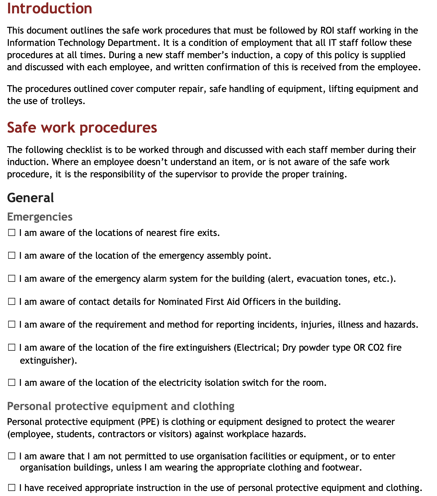
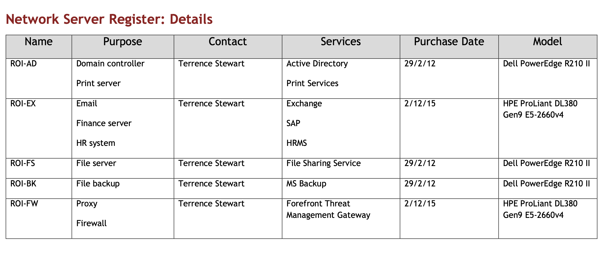
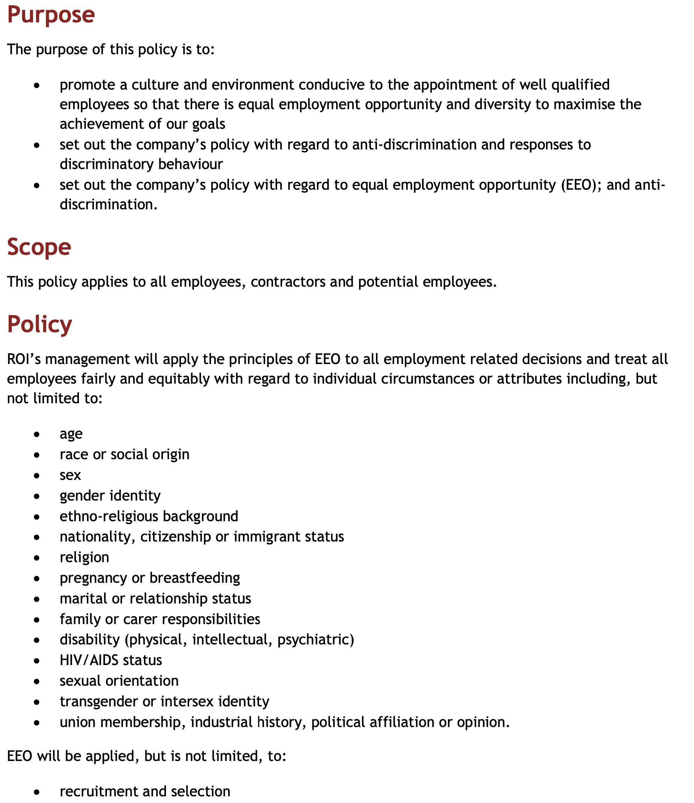

rename this file to: ROI_Data_Analysis_Report_YourName..docx
# Summary of documents

## ROI_Scenario..pdf
Red Opal Innovations (ROI) is an information technology company that commenced operations in 2004. The focus of the business at that time was IT and network consultancy services for small to medium sized businesses.

Three years ago the company decided to add services for the design and development of websites, multimedia products and customised applications.

- Operations
  - 40 full time staff, 20 contract staff
- Departments
  - Director (see: directors office in asset register)
  - Development - Software
  - IT Support (see fuel usage break down by department)
  - Multimedia Production - Video content
  - Sales/Marketing - Advertising, marketing, events, clients
  - HR - Manage staff, entitlements, super
  - Accounts - AP/AR

### Staff

| Name             | Role      | Department              |
|------------------|-----------|-------------------------|
| Wendy Opal       | Director  |                         |
| Terrence Stewart | Manager   | Network IT Support      |
| Vinh Ngyen       | Manager   | Development             |
| Frank Marks      | Manager   | Multimedia Productions  |
| Sally Bach       | Manager   | Sales and Marketing     |
| Amy Corgen       | Manager   | Human Resources         |
| Max Boags        | Manager   | Accounts                |
| B Luff           | Support   | IT                      |
| S Manson         | Support   | IT                      |

../resources/snapshots/

| Type | Name                               | Preview                           | Description             |
|-------------------------------------------|-----------------------------------|-------------------------|

#### List of desktop computers, costings and department location

**ROI_Asset_register.xlsx**

#### Current support tickets

**ROI_Call_logs_current.xlsx**

#### History of support tickets

**ROI_Call_logs_prev.xlsx**

#### Copyright statement

**ROI_Copyright_statement.pdf**

#### Data Analysis Report (template)

**ROI_Data_Analysis_Report_template.dotx**

#### This policy outlines the safekeeping of files and user data, and includes tasks such as 

**ROI_Data_backup_policy.pdf**
backup and restore. Lots more information here

#### Electricity bills on a 2 month basis

**ROI_Elec_usage.xlsx**

#### Email guidelines, Template for sending emails

**ROI_Email_template.docx**

#### Equipment Location Guidelines (student to fill in)

**ROI_Equip_loc_guidelines.docx**

#### Equipment Maintenance Schedule (student to fill in)

**ROI_Equip_maint_schedule.docx**

#### Statistics on fuel usage per department (data)

**ROI_Fuel_usage.xlsx**

#### Hardware/Software Upgrade Request (student to fill in)

**ROI_HW_upgrade_req.docx**

#### The following Guiding Principles will be used by the ITGG to ensure that only quality IT 

**ROI_IT_Gov_policy.pdf**
systems are implemented.

#### Virtualisation is being implemented by many organisations and the IT Support Network 

**ROI_IT_Infr_change_survey_results.pdf**
Manager of Red Opal Innovations, Terrence Stewart

#### IT Maintenance Log (student to fill in)

**ROI_IT_Maint_log.docx**

#### IT Maintenance Plan (student to fill in)

**ROI_IT_Maint_plan.docx**

#### This document outlines the procedures for undertaking hardware and software maintenance 

**ROI_IT_Maint_procedure.pdf**
within ROI. All associated forms are available from the ROI Intranet.

#### This policy document describes the process for researching, procuring and installing 

**ROI_IT_Procurement_policy.pdf**
hardware and software

#### Information Technology Work Health Safety Compliance Checklist

**ROI_IT_WHS_checklist.pdf**

#### Installation Completion (student to fill in)

**ROI_Installation_comp.docx**

#### Installation Plan (student to fill in)

**ROI_Installation_plan.docx**

#### Internal Product_Version Control_20210128

**ROI_InternalProductuct_Version.pdf**

#### Logo

**ROI_Logojpg                     **

#### List of all 5 servers, their purpose and services they offer

**ROI_NW_server_register.pdf**

#### New Staff IT Induction kit, IT support procedure, systems usage

**ROI_New_staff_IT_induction_kit.pdf**

#### The purpose of this document is to plan and document the pilot rollout of the latest 

**ROI_Operating_system_rollout.docx**
version of the operating system used within Red Opal Innovations

#### Organisation chart

**ROI_Org_chart.pdf**

#### Anti-discrimination and EEO Policy, This policy applies to all employees, contractors and 

**ROI_Policy_AD_EEO.pdf**
potential employees.

#### Environmental Sustainability Policy, Red Opal Innovations (ROI) recognises our 

**ROI_Policy_ES.pdf**
responsibility to the environment to operate in an environmentally sustainable and socially responsible manner.

#### Information Technology Work Health Safety Compliance Checklist

**ROI_Policy_WHS.pdf**

#### Privacy Policy

**ROI_Privacy_policy.pdf**

#### Procedure Communication - To provide appropriate protocols to staff to follow.

**ROI_Procedure_Communication.pdf**

#### Records and information management - Effective management of ROI information enables the 

**ROI_Procedure_RecordsManagement.pdf**
organisation to demonstrate efficient and compliant work practices. 

#### Technology start up and shut down - This Procedure sets out the requirements for shutting 

**ROI_Procedure_start_up_shut_down.pdf**
down and restarting IT systems.

#### Use of Personal Protective Equipment (PPE)

**ROI_Procedure_use_of_PPE.pdf**

#### Workstation setup - Procedure sets out the how workstations (including desk, chair and 

**ROI_Procedure_workstation_setup.pdf**
peripherals) are to be set up to suit individual need and the type of work performed

#### Recruitment - This Process sets out the requirements for recruiting new staff members.

**ROI_Process_recruitment.pdf**

#### Quotation Request (student to fill in)

**ROI_Quotation_req.docx**

#### Style guide for reports (student to fill in)

**ROI_Report_template.dotx**

#### SLA - Service Level Agreement IT Support

**ROI_SLA.pdf**

#### SOE

**ROI_SOE.pdf**

#### Scenario

**ROI_Scenario.pdf**

#### Scenario_add_info_1

**ROI_Scenario_add_info_1.pdf**

#### Scenario_add_info_2

**ROI_Scenario_add_info_2.pdf**

#### Scenario_add_info_3

**ROI_Scenario_add_info_3.pdf**

#### Templates for software testing (Test Cases, Test Process, Test result)

**ROI_Software_test_report.docx**

#### IT Strategic Plan (main document)

**ROI_Strategic_plan.pdf**

#### Branding guidelines, Web and print media guides for Logo, Typography, Colour, Images

**ROI_Style_guide.pdf**

#### Template for list of tasks, Template which can be used for planning tasks

**ROI_Task_planner.docx**

#### User Account Policy, The purpose of this document is to outline the policies and 

**ROI_User_account_policy.pdf**
procedures surrounding the creation, distribution and usage of computer user accounts within ROI.

#### Documentation requirements, standards and designs

**ROI_User_doc_plan.docx**

#### User feedback on user manual

**ROI_User_eval.docx**

#### Work Health Safety Policy (Draft) - Provide everyone in the workplace with a safe and 

**ROI_WHS_policy_draft.pdf**
healthy working environment.

#### Graphic assets

**ROI_graphics.zip**

#### List of desktop computers, costings and department location

**ROI_Asset_register.xlsx**

#### Current support tickets

**ROI_Call_logs_current.xlsx**

#### History of support tickets

**ROI_Call_logs_prev.xlsx**

#### Copyright statement

**ROI_Copyright_statement.pdf**

#### Data Analysis Report (template)

**ROI_Data_Analysis_Report_template.dotx**

#### This policy outlines the safekeeping of files and user data, and includes tasks such as 

**ROI_Data_backup_policy.pdf**
backup and restore. Lots more information here

#### Electricity bills on a 2 month basis

**ROI_Elec_usage.xlsx**

#### Email guidelines, Template for sending emails

**ROI_Email_template.docx**

#### Equipment Location Guidelines (student to fill in)

**ROI_Equip_loc_guidelines.docx**

#### Equipment Maintenance Schedule (student to fill in)

**ROI_Equip_maint_schedule.docx**

#### Statistics on fuel usage per department (data)

**ROI_Fuel_usage.xlsx**

#### Hardware/Software Upgrade Request (student to fill in)

**ROI_HW_upgrade_req.docx**

#### The following Guiding Principles will be used by the ITGG to ensure that only quality IT 

**ROI_IT_Gov_policy.pdf**
systems are implemented.

#### Virtualisation is being implemented by many organisations and the IT Support Network 

**ROI_IT_Infr_change_survey_results.pdf**
Manager of Red Opal Innovations, Terrence Stewart

#### IT Maintenance Log (student to fill in)

**ROI_IT_Maint_log.docx**

#### IT Maintenance Plan (student to fill in)

**ROI_IT_Maint_plan.docx**

#### This document outlines the procedures for undertaking hardware and software maintenance 

**ROI_IT_Maint_procedure.pdf**
within ROI. All associated forms are available from the ROI Intranet.

#### This policy document describes the process for researching, procuring and installing 

**ROI_IT_Procurement_policy.pdf**
hardware and software

#### Information Technology Work Health Safety Compliance Checklist

**ROI_IT_WHS_checklist.pdf**

#### Installation Completion (student to fill in)

**ROI_Installation_comp.docx**

#### Installation Plan (student to fill in)

**ROI_Installation_plan.docx**

#### Internal Product_Version Control_20210128

**ROI_InternalProductuct_Version.pdf**

#### Logo

**ROI_Logojpg                     **

#### List of all 5 servers, their purpose and services they offer

**ROI_NW_server_register.pdf**

#### New Staff IT Induction kit, IT support procedure, systems usage

**ROI_New_staff_IT_induction_kit.pdf**

#### The purpose of this document is to plan and document the pilot rollout of the latest 

**ROI_Operating_system_rollout.docx**
version of the operating system used within Red Opal Innovations

#### Organisation chart

**ROI_Org_chart.pdf**

#### Anti-discrimination and EEO Policy, This policy applies to all employees, contractors and 

**ROI_Policy_AD_EEO.pdf**
potential employees.

#### Environmental Sustainability Policy, Red Opal Innovations (ROI) recognises our 

**ROI_Policy_ES.pdf**
responsibility to the environment to operate in an environmentally sustainable and socially responsible manner.

#### Information Technology Work Health Safety Compliance Checklist

**ROI_Policy_WHS.pdf**

#### Privacy Policy

**ROI_Privacy_policy.pdf**

#### Procedure Communication - To provide appropriate protocols to staff to follow.

**ROI_Procedure_Communication.pdf**

#### Records and information management - Effective management of ROI information enables the 

**ROI_Procedure_RecordsManagement.pdf**
organisation to demonstrate efficient and compliant work practices. 

#### Technology start up and shut down - This Procedure sets out the requirements for shutting 

**ROI_Procedure_start_up_shut_down.pdf**
down and restarting IT systems.

#### Use of Personal Protective Equipment (PPE)

**ROI_Procedure_use_of_PPE.pdf**

#### Workstation setup - This procedure sets out the how workstations (including desk, chair 

**ROI_Procedure_workstation_setup.pdf**
and peripherals) are to be set up to suit individual need and the type of work performed at thworkstation. |

#### Recruitment - This Process sets out the requirements for recruiting new staff members.

**ROI_Process_recruitment.pdf**

#### Quotation Request (student to fill in)

**ROI_Quotation_req.docx**

#### Style guide for reports (student to fill in)

**ROI_Report_template.dotx**

#### SLA - Service Level Agreement IT Support

**ROI_SLA.pdf**

#### SOE

**ROI_SOE.pdf**

#### Scenario

**ROI_Scenario.pdf**

#### Scenario_add_info_1

**ROI_Scenario_add_info_1.pdf**

#### Scenario_add_info_2

**ROI_Scenario_add_info_2.pdf**

#### Scenario_add_info_3

**ROI_Scenario_add_info_3.pdf**

#### Templates for software testing (Test Cases, Test Process, Test result)

**ROI_Software_test_report.docx**

#### IT Strategic Plan (main document)

**ROI_Strategic_plan.pdf**

#### Branding guidelines, Web and print media guides for Logo, Typography, Colour, Images

**ROI_Style_guide.pdf**

#### Template for list of tasks, Template which can be used for planning tasks

**ROI_Task_planner.docx**

#### User Account Policy, The purpose of this document is to outline the policies and 

**ROI_User_account_policy.pdf**
procedures surrounding the creation, distribution and usage of computer user accounts within ROI.

#### Documentation requirements, standards and designs

**ROI_User_doc_plan.docx**

#### User feedback on user manual

**ROI_User_eval.docx**

#### Work Health Safety Policy (Draft) - Provide everyone in the workplace with a safe and 

**ROI_WHS_policy_draft.pdf**
healthy working environment.

#### Graphic assets

**ROI_graphics.zip**

