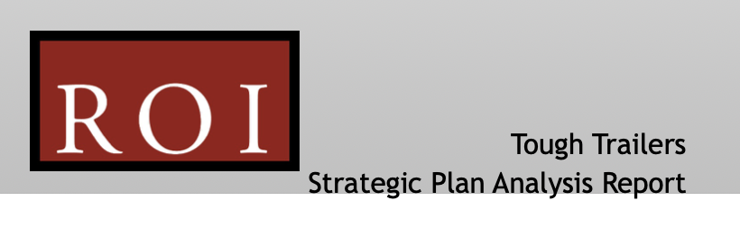

# Tough Trailers - Strategic Plan - Part 3

**Student details**

Student:  880616253 / David Cruwys

**Student signature and Date**

David Cruwys, 27nd Oct, 2021

### Tough Trailers Scenario

You have been recently appointed as a Project Manager in the Development Team with ROI.

The Head of the ROI Development Team, Terrence Stewart, has asked you to start working in collaboration with Tough Trailers to define the problems with their strategic plan and present viable solutions.

While you have access to various business documents, your primary role is to consider the existing ICT infrastructure and its inadequacies to meet current business requirements of Tough Trailers including the impact of these inadequacies.

Please note the ROI Development Team is also working on another project with Tough Trailers that relates to website development for the client. At this stage you are not part of the website development project team.  However, you have been advised to ensure that any probable impact of website development on the business is included in your work.

#### Document Repository

- [Tough Trailers Scenario](./documents/Tough%20Trailers%20Scenario.pdf)
- [Tough Trailers Strategic Plan](./documents/Tough%20Trailers%20Strategic%20Plan.pdf)
- [Existing ICT Resources](./documents/Existing%20ICT%20Resources.pdf)
- [ICT Expense Summary](./documents/ICT%20Expense%20Summary.pdf)
  
Extra

- [ROI_Org_chart](./documents/ROI_Org_chart.pdf)
- [ROI_Report_template](./documents/ROI_Report_template.dotx)
- [ROI_Scenario](./documents/ROI_Scenario.pdf)

## Part 2: Evaluate current strategic plan

## Cover Page

**Document Change History**

|**Version** |**Type**|**Date**|**Detail**|
| :- | :- | :- | :- |
| 1.1 | Create | 1 Oct, 2021 | Create Skelton for Report |
| 1.2 | Review | 6 Oct, 2021 | Add in TOC |
| 1.3 | Update | 27 Oct, 2021 | Add to background information |
| 1.4 | Update | 28 Oct, 2021 | Add Current Strategic Plan |
| 1.5 | Update | 29 Oct, 2021 | Add Current Business Requirement |
| 1.6 | Update | 29 Oct, 2021 | Add Current ICT System |

## Document Sign-off

|**Stakeholder** |**Role**|**Sign off**|
| :- | :- | :- |
|Bob Sedgewick | Managing Director | &#9744; |
|David Cruwys| ROI Project Manager |  &#9745; |
|Terrence Stewart | ROI Development Manager | &#9744; |
|James Mansour | Chief Finance Officer | &#9744; |
|Jenny Smith | Office Manager | &#9744; |
|Wolfgang Wiss | Head of Manufacturing | &#9744; |
|Celia Norton | HR Manager | &#9744; |
|Ellen Chu | IT Manager | &#9744; |
|Angelo Cassati | Sales & Mktg Manager | &#9744; |

## Table of Contents

1. [Cover Page]()
2. [Version Control Information]()
3. [Document Sign-off]()
4. [Introduction](#introduction)
5. [Report body](#report-body)
6. [Background information](#background-information)
  - 6.1. [Current Strategic Plan](#current-strategic-plan)
  - 6.2. [Current Business Requirement](#current-business-requirement)
  - 6.3. [Current ICT System](#current-ict-system)
  - 6.4. [Appraisal of current gap analysis technique](#appraisal-of-current-gap-analysis-technique)
  - 6.5. [SWOT Analysis](#swot-analysis)
  - 6.6. [Business weaknesses or inadequacie](#business-weaknesses-or-inadequacie)
  - 6.7. [Impact on Tough Trailers business](#impact-on-tough-trailers-business)
7. [Conclusion](#conclusion)

## Introduction

## Report body
  
### Background information

**Company Overview**

Tough Trailers (formerly Tough Steel) was founded in 2000 as an architectural metal fabricator, they diversified into small box trailer manufacturing in 2007. By 2010, the trailer business had grown so much that they made the decision to become a full-time trailer manufacturer and re-branded as "Tough Trailers".

Tough Trailers produces both standard and customized box trailers.

The factory and Head office is in Newcastle with showrooms in Sydney, Melbourne and Brisbane.

With 1500 customers and Turnover of \$10M, Tough Trailers has seen sales increase by 40% each year in the last two years.

**Customers**

Customers range from home handyman to horse owners, trade persons, serious off-roaders and a variety of motor sports people

Trailers come in a variety of styles, including small box trailer \$1,000, to utility trailers and customised trailers.

Custom trailers include horse floats, off-road, car or bike carriers in ranging from \$1,300 to over \$10,000.

The custom trailers have become more popular recently, particularly with trades persons and motor sports people.

**Problems**

The company internal systems and computer systems have worked well in the past, but with the increase in sales, they realize that they may not be able to cope with continued expansion.

The main ares of concern are:

- The Designer/Estimator liaises with Manufacturing to obtain quotes for the customised trailers.
  - Quotes for custom trailers are taking too long.
  - The customers love the unlimited design scope, but waiting on quotes from manufacturer is loosing business.

- Sales catalogues are very basic
- Showrooms only hold a limited number of demonstration items.
- There is not gallery of past custom trailers that have been built in the past.
- Customers want to be able to see more examples of the types of customised trailers that can be produced.

**Future Strategies**

- A determined push into the customised trailer market with provision for people who want some individualisation of their trailers.
- Producing a range of modular components that can be volume manufactured.
- Expand their sales outlets through the opening of dealerships, possibly using a franchise model (this has not yet been evaluated, but maybe persued later).
- Create a website to provide information about standard and customised trailers
  - Online catalogue.
  - Sell directly to customers through online ordering. 
  - Integrate with their current systems for payments.
  - Easy content management
  - Budget of \$30,000 for the website, which can be completed in two stages.

### Current Strategic Plan

> Make sure you review each of the seven stages of the strategic plan and the Action Plans Table.

Tough Trailers has a vision to "provide customised trailer solutions to customers where quality and looks go together"

Their mission is to provide an end-to-end solution for customers with bespoke trailer requirements that includes design, manufacture and the highest quality and back that up with exceptional customer and after sales service.

**SWOT Summary**

- Tough trailers has a strong core business with great products, workforce and partners.
- They are challenged in the areas of communication, training, processes, and sales/customer information systems.
- The opportunity is base on their efficient manufacturing practices and market growth, but could scale via franchising or dealerships and needs some sort of customer retention initiative, such as loyalty programs.
- The main problem is new competition, communication systems, legislative policies and currency movements.

**Near Term Goals**

- Customer retention and aquisition based on Service, Satisfaction and Retention principle
- Operational efficiency based on improved production turn-around and staff training on production, technology and legislation.
- Financial goal is based on maintaining 30% increase in growth over the next two years

**Long Term Goals**

- Double sales over next 5 years, grow revenue (retained profits) by 15% per year in 5 years.
- Open a new channel for sales via website and increase online sales to 50% (half) of total sales in 5 years
- Explore and evaluate franchising and dealership ideas
- Explore diversification options
- Production & manufacturing capacity keeps up with market demand

**Plan of Action Summary**

Customer oriented

- Professional and friendly environment
- Knowledgeable Designers, Estimates and Sales Consultants
- Communication systems covering post-sales marketing and feedback plus support.
- Automated marketing systems.
- Ongoing training, workshops and seminars

Operations

- Increase manufacturing and production efficiency
- Efficient staff on-boarding and training via HR and procedures.
- Move to modular component development manufacturing
- ICT infrastructure and applications to serve both business and customers efficiently
- Business website, information portal, eCommerce and design facilities.
- Ongoing training and development programs for all six sections to ensure compliance, industry standards, legislative requirements and technology advancements are covered

Financial

- Implement new revenue growth strategies.
- Create a balance between profit increase and reinvestment for product R&D / business growth.

### Long-Term

- Increase in business through online sales using the business website
- Franchising and dealership options being considered, discussed and finalised
- Probable contract with a financial institution for preferred loan provider
- One-window sales and maintenance operations to be introduced and implemented
- Developing an efficient workforce through proper recruitment and induction procedures with ongoing training, incentives for employee retention

### Current Business Requirement

The existing Tough Trailers business has a head office is in Newcastle with showrooms in Sydney, Melbourne and Brisbane and turnover \$10M.

Our broad goal is to grow our 1500 customer base, double our sales over 5 years and grow revenue (retained profits) by 15% per year in 5 years.

We have two core strategies that we are focused on to achieve these goals:

1. Modernise our IT systems
   - Create online sales and marketing systems (via website)
   - Staff training, development and compliance.
   - Product/catalogue management system
   - Virtual tools for designers and bespoke customizations.
   - eCommerce portal to self direct to customers
   - VR Goggles in showrooms to view trailer concepts.
   - Sales and communication tools (faster quote, better followup)
2. Modular Component Manufacturing
   - Increase production capacity
   - Upgrade the existing process of prefab manufacturing to modular manufacturing
   - Support a range of trailer bases, industry specific components and generalized accessories
     - This is to lesson the cumbersome individual customizations that we currently do.
     - [Reference: Examples](https://www.modularcomponents.com.au/)
   - Volume produce modular components, and/or
   - In-line 3D facility to print components for just in time turn around and/or component prototypes
   - Integrate IT in this process
     - Brochures / Catalogues
     - Inventory Management
     - CAD Design Tools
     - DIY Online Design Tools
     - Custom Colour Schemes and Visualizations

An additional requirement (outside of the core strategies) will be these three areas of concern:

1. How can we grow the business? "Franchising and Dealerships" plus other options to be explored
4. How do we maintaining production / manufacturing capacity? Can we meet market demands using explore prefab, modular and/or 3D print production lines.
5. What is the best product fit for the ever changing market? Explore diversification options and new types of trailer markets such as Grey Travel and Digital Nomads.

Other references:

- [Popup Factories](https://modular.org/HtmlPage.aspx?name=MA-pop-up-factories)
- [Modular Food Lines](https://www.foodengineeringmag.com/articles/98983-modularity-brings-flexibility-in-automating-production-lines)
- [5 Industries using 3D printing](https://markforged.com/resources/blog/five-industries-utilizing-3d-printing)

**What is modular type?** *Modular design, or modularity in design, is a design principle that subdivides a system into smaller parts called modules (such as modular process skids), which can be independently created, modified, replaced, or exchanged with other modules or between different systems.*

|**Key Stakeholders** |**Category**| **Requirement** |
| :- | :- | :- |
| Board of Directors | Internal | Business and profit growth |
| ROI Consultants | External | Deliver on Tough Trailers expectations |
| Finance | Internal | Budget and funding for any strategic initiative |
| HR | Internal | Streamline systems for recruiting and onboarding staff across different departments |
| Operations | Internal | Increase systems efficiency and have no bombshells |
| Manufacturing | Internal | How can manufacturing automation be applied using ICT, how do we improve turn around |
| IT | Internal | Systems need to be scalable and resilient |
| Sales & Marketing | Internal | Easy management of products, promotions and customers |
| Customers | External | Quick delivery, simple and bespoke trailers |
| Distributors | External | Automation for sales, marketing and customer enquiries |
| Suppliers | External | Automation for communication and product delivery |

### Current ICT System

Tough Trailers has four locations (Newcastle, Sydney, Melbourne, Brisbane) each with standard Windows Based LAN.

There is no centralized server, they are managed independently and upgraded as needed.

All white-color staff (office/sales) have access to desktop or laptop computer running Windows 10

None of the desktops, laptops or networks are running virus projection and there is no network firewall or security policy and most machines are mid-range and a few years old.

The blue-color staff (manufacturing) only use shared computing resources. 1 PC for head of manufacturing and 2 PCs for 16 workers (welders and fitters)

**Custom software**

- SalesTRAC for Sales department
- AutoCAD for Designers, Estimaters and manufacturing (Fitters/Welders)

**Custom hardware**

- General purpose printers at each location
- Departmental printers for sales, admin and Finance
- Large multipurpose printer for Manufacturing
- The managing director and head of HR are high end hardware

**Weakness in Current ICT System:**

> - Insecure
> - Costly to maintain
> - Does not support scalability if the workforce grows.
> - Decentralized and so not easily managed from central location.

## Appraisal of current gap analysis technique

### SWOT  Analysis

Your SWOT Analysis however, should focus on ICT requirements and
consider internal and external factors for all four components of SWOT.
You will need to consider stakeholders, their requirements and the business requirements. 

| |**Internal**|**External**|
| :- | :- | :- |
|**Strengths**| - Strong core business, quality products, high professional standards, efficient workforce. - Good turnover and year on year growth in sales | - Strong brand, loyal customers, good partners.   - Have a wide range of products and customisations |
|**Weaknesses**| - IT Systems do not scale - Insecure IT Systems (Malicious/Data Theft) - Not centrally managed - Physical computers (no virtualisation)  - Design not exportable to Marketing/Catalogues   - Design not integrated to 3D or Prefab production  - No software integrations sales -> orders -> build -> delivery pipeline.  - Lack of in house expertise with modular manufacturing  - Company and Department Training via Online Tools| - No Digital Training Repositories for White or Blue Collar  - Insecure IT Systems (Penetration)  - Substandard information brochures  - Lack of online Catalogue,   - Online Design/Customization Tools  - SAAS Support/Ticketing/Help System|
|**Opportunities**| - Add to our engineering excellence with new (or trained existing) staff in modular and 3D manufacturing techniques.  - Invest in new production tooling.  - Move toward Just In Time manufacturing techniques  - Move to Virtualized Computing Environment (Cloud or OnPrem) | - Find local manufacturing facility with 3D/Modular production line to partner with or acquire.  - Develop a Franchise Model  - Develop an Agency Model  - Develop an Affiliate Model and work with influencers|
|**Threats**| - Finding Skilled Workers  - Communication Systems  - Moral and Training | - Strong price oriented online competitors (especially via Amazon)  - Currency fluctuation/s mean we should not hold too much stock (JIT Manufacturing schedule may be solution)  - Legislative changes need to be transferred to staff |

### Business weaknesses or inadequacies

The core manufacturing business revolves around standard build templates and when a customization is needed, the designers, fitters and welder draw on past experience to deliver a bespoke solution each time.

- Manufacturing could see greatly increased effectiveness by taking on 3D and Modular manufacturing techniques.
- Existing staff are not skilled in new production line processes
- Custom designs have a long build and deliver schedule

The sales and marketing side of the business uses expensive and somewhat outdated practices.

- Showrooms are a major expense and only service local regions
- Catalogues only have standard products (not customisations)
- Custom designs require access to in-person designer

Little presence in the online space.

- Missing opportunities for a large number of interstate, regional and online savvy customers
- New designs and customizations cannot be displayed via online portal
- No access to bloggers or influencers (they tend to write or share about online systems)

No Vertical Integration

- Isolated LANs - A lack of centralised ITC infrastructure across manufacturing, sales, office (HR, Training, Ops)
  - Systems are Siloed.
  - Operations cannot see SalesTRAC
  - Sales People cannot see or use AutoCAD.
- Lack of SASS or On Premise systems that can talk to each other. 
  - CRM (Accounts, Help Desk)
  - Sales, Marketing (eCommerce, SMS/Email Marketing, Online Portal)
  - CAD/CAM (Computer Aided Design/Manufacturing)
- Support
  - Hard to do remote support
  - Hard to upgrade the entire company
  - Security concerns

### Impact on Tough Trailers business

See: [Part 4](assessment-1of3-tough-trailers-part4.md)

