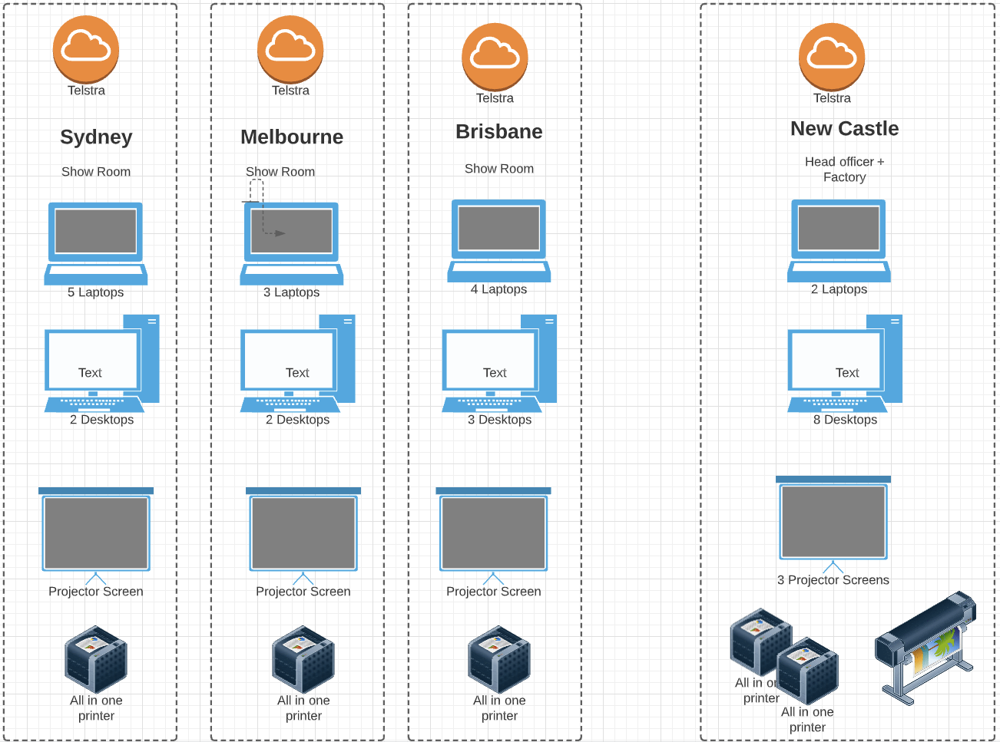
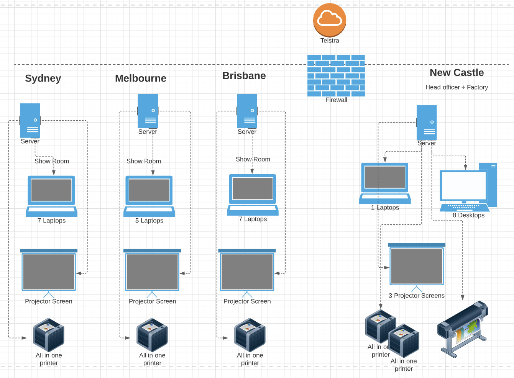

# Tough Trailers - Strategic Plan Proposal

**Student details**

Student:  880616253 / David Cruwys

**Student signature and Date**

David Cruwys, 27nd Oct, 2021

### Tough Trailers Scenario

You have been recently appointed as a Project Manager in the Development Team with ROI.

The Head of the ROI Development Team, Terrence Stewart, has asked you to start working in collaboration with Tough Trailers to define the problems with their strategic plan and present viable solutions.

While you have access to various business documents, your primary role is to consider the existing ICT infrastructure and its inadequacies to meet current business requirements of Tough Trailers including the impact of these inadequacies.

Please note the ROI Development Team is also working on another project with Tough Trailers that relates to website development for the client. At this stage you are not part of the website development project team.  However, you have been advised to ensure that any probable impact of website development on the business is included in your work.

#### Document Repository

- [Tough Trailers Scenario](./documents/Tough%20Trailers%20Scenario.pdf)
- [Tough Trailers Strategic Plan](./documents/Tough%20Trailers%20Strategic%20Plan.pdf)
- [Existing ICT Resources](./documents/Existing%20ICT%20Resources.pdf)
- [ICT Expense Summary](./documents/ICT%20Expense%20Summary.pdf)
  
Extra

- [ROI_Org_chart](./documents/ROI_Org_chart.pdf)
- [ROI_Report_template](./documents/ROI_Report_template.dotx)
- [ROI_Scenario](./documents/ROI_Scenario.pdf)

## Part 2: Evaluate current strategic plan

## Cover Page

## Document Version

|**Version** |**Type**|**Date**|**Detail**|
| :- | :- | :- | :- |
| 1.1 | Create | 17 Nov, 2021 | Create Skelton for Report |
| 1.2 | Review | 18 Nov, 2021 | Add in TOC |
| 1.3 | Update | 20 Nov, 2021 | Add to background information |
| 1.4 | Update | 20 Nov, 2021 | Add Current Strategic Plan |
| 1.5 | Update | 20 Nov, 2021 | Add Current Business Requirement |
| 1.6 | Update | 21 Nov, 2021 | Add Current ICT System |

## Document Sign-off

|**Stakeholder** |**Role**|**Sign off**|
| :- | :- | :- |
|Bob Sedgewick | Managing Director | &#9744; |
|David Cruwys| ROI Project Manager |  &#9744; |
|Terrence Stewart | ROI Development Manager | &#9744; |
|James Mansour | Chief Finance Officer | &#9744; |
|Jenny Smith | Office Manager | &#9744; |
|Wolfgang Wiss | Head of Manufacturing | &#9744; |
|Ellen Chu | HR Manager | &#9744; |
|Ellen Chu | IT Manager | &#9744; |
|Angelo Cassati | Sales & Mktg Manager | &#9744; |

## Table of Contents

1. [Cover Page]()
2. [Version Control Information](#document-version)
3. [Document Sign-off]()
4. [Table of Contents]()
5. [Introduction](#introduction)
6. [Report body](#report-body)
  - 6.1 [Background information](#background-information)
  - 6.2. [Current ICT network and hardware]()
  - 6.3. [Options Analysis]()
  - 6.4. [Suitable options]()
  - 6.5. [Options costings]()
  - 6.6. [Options comparison]()
  - 6.7. [Preferred option]()
  - 6.8. [Impact of proposed change]()
  - 6.9. [Action Plan]()
7. [Conclusion](#conclusion)

## Introduction
  
### Background information

**Company Overview**

Tough Trailers (formerly Tough Steel) was founded in 2000 as an architectural metal fabricator, they diversified into small box trailer manufacturing in 2007. By 2010, the trailer business had grown so much that they made the decision to become a full-time trailer manufacturer and re-branded as "Tough Trailers".

Tough Trailers produces both standard and customized box trailers.

The factory and Head office is in Newcastle with showrooms in Sydney, Melbourne and Brisbane.

With 1500 customers and Turnover of \$10M, Tough Trailers has seen sales increase by 40% each year in the last two years.

**Problems**

The company internal systems and computer systems have worked well in the past, but with the increase in sales, they realize that they may not be able to cope with continued expansion.

**Why we need to change**

We need to upgrade ICT for the entire company so that we can expand quickly:
- On board new staff
- take advantage of new cloud applications in all areas of our business
  - Sales
  - Marketing
  - Training
  - Product Design
  - Product Creation
- Adapt to the changing world of eCommerce
- Create integrations with our dealerships, suppliers and other external systems
- Security
- Contingency against issues1 like COVID
 which can be completed in two stages.

### Current ICT network and hardware

### Options Analysis

|**Technology**|**URL (s)**|**Research Findings**|
| :- | :- | :- |
|Virtualisation|[Virtual 7 ways](https://www.colocationamerica.com/blog/7-ways-virtualization-helps-business)| Virtualization will help tough trailers to optimize their physical space. As servers can be divided into multiple Virtual Machines (VM), with each VM being used by individual staff members, the number of physical servers and desktops reduces considerably, and operating system / application updates can be managed quickly|
|Cloud computing|[Cloud For Franchises](https://www.thefranchiseking.com/cloud-services-for-franchises)|Granular Scalability, Unified Communication System, Tighter security, Off Site Management, Cost savings|
|Browser based operating systems, chromebook|[Great and Not so Great](https://www.entrepreneur.com/article/220120)|Pro: Cheap, Very Mobile, Web Access, Con: Rarely integrates well with desktop applications like AutoCAD |

### Suitable options

From the options analysis we should look further into the Virtualisation, Cloud computing combination.

Cloud computing is great for pay only for what you use, no need to invest in expensive implementations (upfront purchase, expensive contractors).

This solution will open us up to scaling the business, is remote friendly and managed for us.

Providers:
  - AWS
  - Google Cloud
  - Azure
  - Other proprietary SAAS applications

Virtualisation is great for offloading heaving processing onto powerful servers while also providing desktop like environments that can scale with staffing as required and our staff can keep using their custom design software products.

The addition of VPN's would allow staff to work remotely on any device whilst having control over security and access.

### Options costings

|**Option**|**Description**|
| :- | :- |
|Cloud - Applications| An application such as Office 360 or SalesForce will have have a per seat (employee) cost of around \$5-30 per month for simple applications, these cost grow or decline based on usage |
|Cloud - Servers | Server instances are tailored to a specific requirement, SQL Server hosting, Desktop Virtualisation, VPN, DNS etc. Costs can range from a couple of dollars per month to hundreds of dollars based on usage tiers, e.g high powered database may be $200+ per month |
|Server Virtualisation| On premise virtualisation can be incredibly powerful for scaling our commputing instances but it has an initial cost for servers \$5-15K per server for a business like tough trailers, plus an installation cost, 1-3K and monthly management, $500+ |

### Options comparison

#### Cloud Applications

**Pros:** 

Can solve certain problems such as (Sales/Marketing CRM, EDM), Communication (Email, Slack), Office (Google Docs/Office 360) with great power and affordability.

**Cons:**

- May not provide custom control or integrations
- Staff may be given Office 360, but use Google Docs at home and are not happy with the change

#### Cloud Servers

**Pros:** 

- Affordable and relatively easy to provision and scale for different types of servers.

**Cons:** 

- Latency can be an issue as servers are not on premise.
- Requires consultants to manage properly.
- May not always integrate nicely with on premise ICT, e.g. Digital factory, Jills Commodore 64

#### Server Virtualisation

From a cost point of view, this sits between our current LAN based ICT and previously mentioned Cloud Servers

**Pros:** 

Compared to current LAN

- Scalable
- Central management
- Easier to secure
- Easier to upgrade apps and operating systems

**Cons**

- Initial setup can be Costly
- Consultants or in-house experts are needed
- People might be used to there existing software applications and these may not be available

### Preferred option

The preferred option is to go with virtualisation to solve the issue off our current LANs (costly, location based, non-scalable, non-secure)

This option should be used for the internal network, printers, desktop applications and virtual desktops.

Where possible, this should be paired with specific Cloud Applications.

Note: if we go with cloud applications from big providers, then we should try to use apps from their stack where possible. E.g. MS App Stack, Google App Stack, Amazon App Stack

Using networking diagram drawing software, prepare a network diagram that demonstrates the preferred option
and include this with your answer. You do not need to prepare a networking diagram for all identified options.

### Impact of proposed change

Change management and training will need be implement as people will be moving from devices and setups that they are comfortable with to new ways of operating.

Some tools / applications are going to be a lot better for the team and for collaboration, but people are going to notice certain features are missing of hidden from their view and this will create frustration.

There will be an initial loss of productivity as new systems are implemented and old systems are deprecated.

### Action Plan

See: [Part4](./assessment-2of3-tough-trailers-project2-part4.md)
