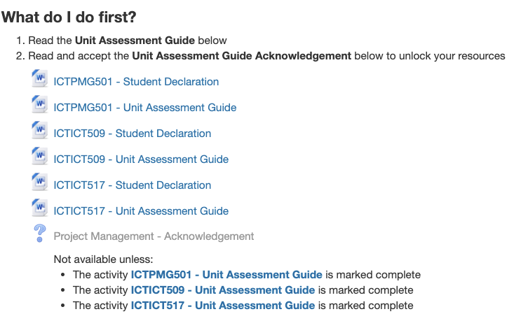

# Project Management

Teacher : Nicholas Attlee
Email   : nicholas.attlee1@tafensw.edu.au

Moodle: https://learn.sydneytafe.edu.au/course/view.php?id=8315

My Project: https://www.youtube.com/watch?v=0Xz2M_Eej0g

What will I learn?

You will learn how to:

- Manage project definition activities
- Undertake project planning
- Establish the IT project team
- Manage project execution activities
- Coordinate project closure
- Identify key information sources
- Gather data
- Prepare data analysis for review
- Evaluate current strategic plan and propose changes
- Evaluate effect of changes
- Plan implementation of changes

## Useful Resources

- [What is Strategic Planning?](https://www.diycommitteeguide.org/resource/what-strategic-planning)
- [How to create an action planURLCompleted: How to create an action plan](https://consciousgovernance.com/blog-archives/how-to-create-an-action-plan-that-supports-your-strategy)
- [Strategic planning: the basics](https://www.bgateway.com/resources/strategic-planning-the-basics)
- [ICT strategic planning](https://www.framegroup.com.au/capabilities/ict-strategic-planning/)
- [Guide to Gap Analysis](https://www.smartsheet.com/gap-analysis-method-examples)
- [Implementing change with impact](https://www.mckinsey.com/~/media/McKinsey/dotcom/client_service/Implementation/implementing_change_with_impact_FINAL.ashx)
- [Problem Statements - BA](http://www.bawiki.com/blog/20130812_Better_Business_Analysis_Through_Problem_Statements.html)
- [Problem Domain](https://wiki.c2.com/?ProblemDomain)
- [PMI - Stakeholder Analysis](https://www.pmi.org/learning/library/stakeholder-analysis-pivotal-practice-projects-8905)
- [Techniques For ElicitingRequirement](https://agilemodeling.com/essays/agileRequirements.htm#TechniquesForElicitingRequirement)
- [UML Patterns - Use Cases](./resources/Pdfs/larman-ch6-applying-evolutionary-use-cases.pdf)
- [Volere Method for Atomic Requirements](./resources/Pdfs/06-Atomic-Requirements.pdf)
- [Capturing Architectural Requirements](./resources/Pdfs/Capturingarchitecturalrequirements.pdf)

## Requirements

Example: Red Opal Innovations Company

- Talk to stakeholders
- Technical documents
- Something that the system/solution under development should do
- Different types
  - Functional
    - Goals of the system
    - Use Case
    - Use Case Diagrams
    - User Stories
    - C4 Architecture Diagrams
    - Volare Methods
  - Non-Functional
    - Different categories (or qualities requirements)
    - Accessibility
    - Usability
    - Scalability
    - Performance
  - Constraints
  - One way to categories requirements: FURPS+

## Stake Holders

- Business objective

- Types
  - Influence - Project Sponsors
  - Effected - Has impact, customers, users
  - Document who they are
  - Engagement
    - UX/Interview Questions
    - Phone calls
    - Online meetings

## Business Analysis

See: [readme-wk1.md](./readme-wk1.md)

Includes: 
see: strategic planning, problem domain, what questions would we ask stakeholders

- Project Problem Statements
- Writing Problem Statements
- Problem domain
- 

