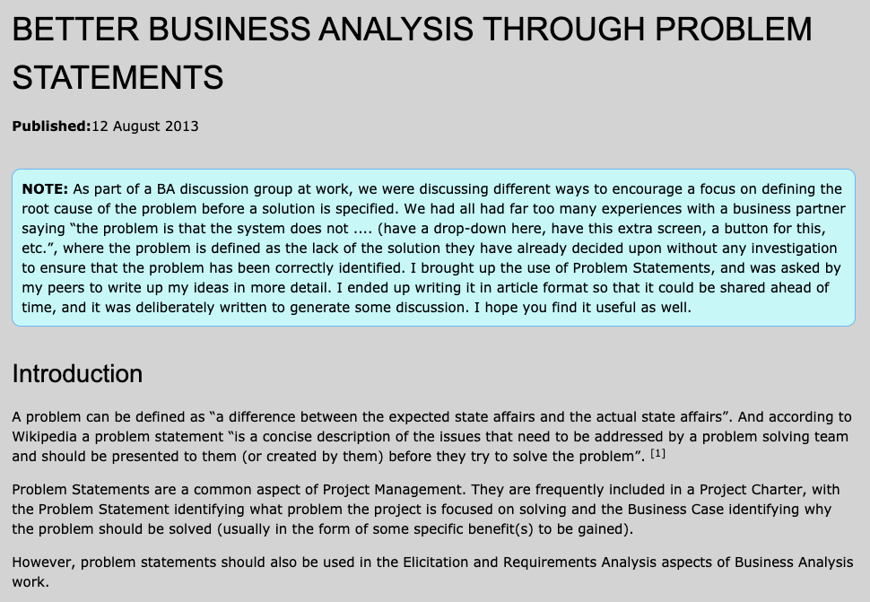
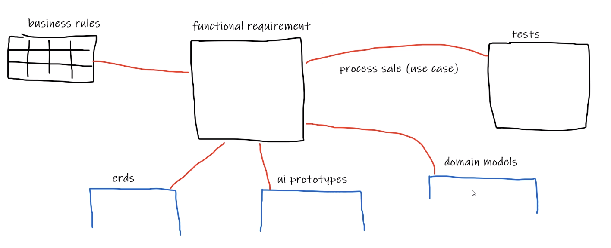

# Project Management

Teacher : Nicholas Attlee
Email   : nicholas.attlee1@tafensw.edu.au

## Business Analysis

[Better Business Analysis Through Problem Statements](http://www.bawiki.com/blog/20130812_Better_Business_Analysis_Through_Problem_Statements.html)

### Project Problem Statements

A good problem statement in a Project Charter should essentially specify the scope by defining:

- A description of the problem elements (with specific measures where possible)
- Identify the stakeholders affected
- Describe the impact of the problem (with specific measures where possible)

#### Writing Problem Statements

Writing problem statements can start with the same process at both the project management and requirements levels.

- What is the problem?
- Who has the problem?
- Where does the problem occur?
- When does the problem occur?
- What does the problem impact?

In the end, each problem statement at the requirements level should meet the following criteria: [5]

- Focused on only one Problem.
- One or two sentences long.
- Does not suggest a Solution

##### Problem Statement break down

- A project is (usually) initiated in order to solve a specific problem or take advantage of an opportunity.
- The problem statement describes the problem
- Having a clear understanding of the problem means we can better evaluate which solution wil most effectively address the problem (business case)

#### Problem domain 

[ProblemDomain](https://wiki.c2.com/?ProblemDomain)

- A problem domain is the domain (sphere of knowledge) within which the problem statement exists.

- For example, a restaurant that has issues related to table bookings (problem) operates within the domain of restaurant booking.

- Having a deep understanding of the problem domain is essential to build software that effectively solves the problem.

- Some tools we can use to understand the problem domain:
  - Interview domain experts (including a wide variety of individuals)
  - Building a domain model
  - Business process modelling
  - Examine documents and procedure manuals

Also known as the ScopeOfAnalysis or, to an analyst, the scope. When collecting UserStories or UserRequirements, whatever, how do you decide which ones are relevant?

- Analyse Existing System

  - What does the system currently do?
  - Manual Procedures
  - Automated Procedures
  - Procedure Process Guides
  - How to elicit/identify problems
    - Technique: Event Storming

- Functional Requirements
  - Business rules
  - ERD
  - UI Prototypes (low and high fidelity)
  - Domain Models (DDD)
  - Tests
    - Unit Tests
    - Integration Tests
    - UA Tests

- Prioritizing Requirements

  - [MoSCoW Method](https://en.wikipedia.org/wiki/MoSCoW_method)

- Constraints
  - Are there any constraints

#### PDCA

- [PDCA](https://en.wikipedia.org/wiki/PDCA) - Plan Act Do Check
- Related to SCRUM (Retrospectives)
  - Plan to do Something
  - Act on the plan
  - Do it
  - Reflect on the plan

This is about quality assurance

#### Verification vs Validation

https://www.easterbrook.ca/steve/2010/11/the-difference-between-verification-and-validation/

#### Capture Requirements Document

Table, Bullet Points etc.

### GAP Analysis

Where are we
Where do we want to go

FOR: RED OPAL Innovations

[Networks](https://community.fs.com/blog/network-switch-router-firewall-why-need-all-three.html)

### Analyzing documents

How do you analyze a document to extract requirements, stakeholder, rules, constraints

Create list of documents and decide if they are relevant to the project.

What is the problem, what is the scope

